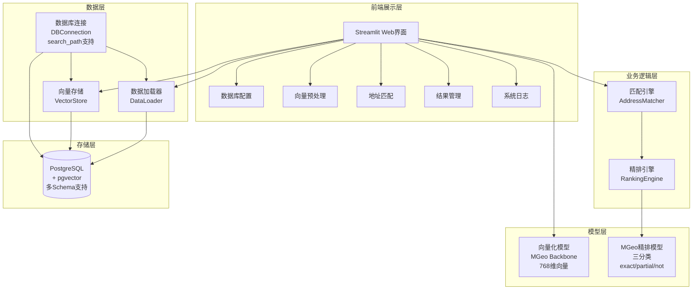
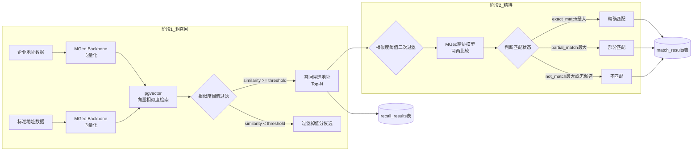
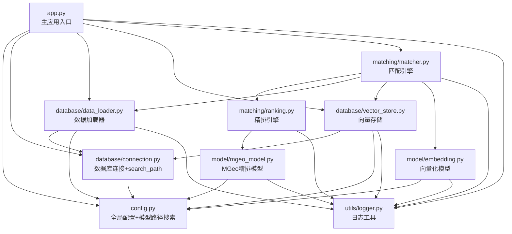
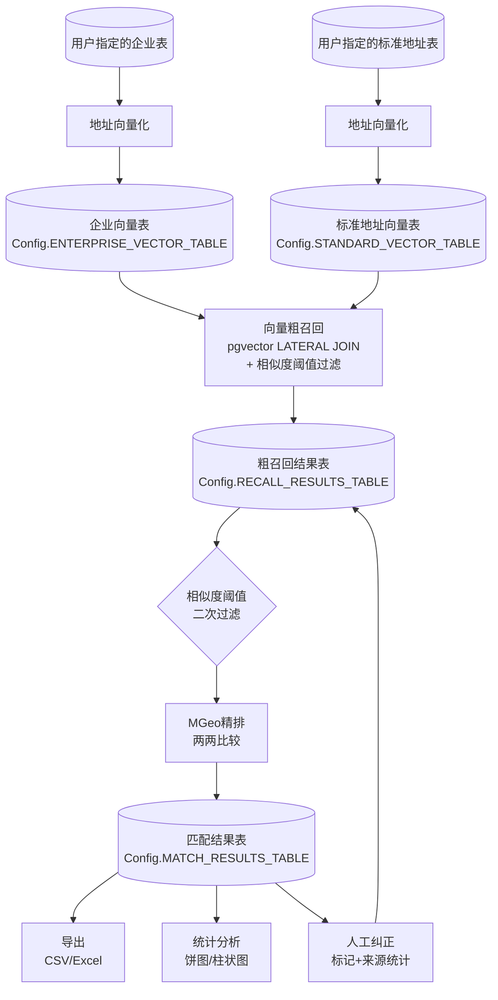
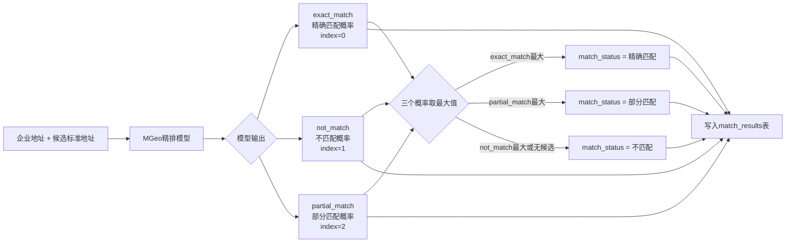

# 中文地址语义匹配系统 - 项目架构图

## 一、系统整体架构



## 二、两阶段匹配流程



## 三、模块依赖关系



## 四、数据流转图



## 五、项目目录结构

```
address_match/
├── app.py                          # 主应用入口（Streamlit）
├── config.py                       # 全局配置 + 模型路径自动搜索
├── requirements.txt                # Python依赖
├── .env                            # 环境变量配置
├── DEPLOYMENT.md                   # 部署文档
├── OPERATION_MANUAL.md             # 操作手册
├── ARCHITECTURE.md                 # 架构文档
│
├── models/                         # 本地模型存放目录（可选）
│   └── iic/
│       ├── mgeo_backbone_chinese_base/
│       └── mgeo_geographic_entity_alignment_chinese_base/
│
├── database/                       # 数据库模块
│   ├── __init__.py
│   ├── connection.py               # 数据库连接管理（search_path + quote_identifier）
│   ├── data_loader.py              # 数据加载与结果写入（表名参数化）
│   └── vector_store.py             # 向量存储与检索（阈值过滤 + table_type参数）
│
├── matching/                       # 匹配模块
│   ├── __init__.py
│   ├── matcher.py                  # 匹配引擎（粗召回+精排调度+阈值传递）
│   ├── ranking.py                  # 精排引擎（MGeo模型调用+阈值过滤）
│   └── mgeo_similarity.py          # MGeo地址相似度独立匹配
│
├── model/                          # 模型模块
│   ├── __init__.py
│   ├── embedding.py                # 地址向量化（多路径搜索+回退加载）
│   └── mgeo_model.py               # MGeo精排模型（多路径搜索+回退加载）
│
├── utils/                          # 工具模块
│   ├── __init__.py
│   ├── logger.py                   # 日志工具
│   ├── progress.py                 # 进度跟踪
│   └── export.py                   # 数据导出（Excel/CSV）
│
├── tests/                          # 测试模块
│   ├── __init__.py
│   ├── run_tests.py                # Schema和表名修复测试
│   ├── test_model_loading_fix.py   # 模型加载修复测试
│   ├── test_threshold_fix.py       # 相似度阈值修复测试
│   └── test_manual_correction.py   # 人工纠正功能测试
│
└── .trae/                          # Trae IDE 配置
    └── rules/
        └── 项目基本要求.md
```

## 六、核心类说明

| 模块 | 类/函数 | 职责 |
|------|---------|------|
| app.py | main() | Streamlit应用入口，页面路由 |
| app.py | show_db_config() | 数据库配置页面（支持Schema配置） |
| app.py | show_vector_preprocess() | 向量预处理页面（字段默认选第一个） |
| app.py | show_address_matching() | 地址匹配页面（相似度阈值配置） |
| app.py | show_result_management() | 结果管理页面（人工纠正+翻页回调） |
| app.py | ranking_thread_func() | MGeo精排线程函数（含阈值过滤） |
| app.py | _goto_page() / _prev_page() / _next_page() | 翻页回调函数（解决session_state绑定问题） |
| config.py | Config | 全局配置类（动态模型路径搜索） |
| config.py | _find_model_local_path() | 自动搜索本地模型路径 |
| database/connection.py | DBConnection | PostgreSQL连接管理（自动设置search_path） |
| database/connection.py | quote_identifier() | SQL标识符双引号引用（支持中文表名） |
| database/data_loader.py | DataLoader | 数据加载、结果写入、筛选、统计、导出、人工纠正（表名参数化） |
| database/vector_store.py | VectorStore | 向量存储、索引、检索（阈值过滤+table_type参数） |
| matching/matcher.py | AddressMatcher | 匹配引擎（粗召回+精排调度+阈值传递） |
| matching/ranking.py | RankingEngine | 精排引擎（MGeo模型封装+阈值过滤） |
| matching/ranking.py | determine_match_status() | 匹配状态判断函数 |
| matching/mgeo_similarity.py | MGeoSimilarityMatcher | MGeo地址相似度独立匹配器 |
| model/embedding.py | AddressEmbedder | 地址向量化（多路径搜索+modelscope/transformers回退加载） |
| model/mgeo_model.py | MGeoModel | MGeo精排模型（多路径搜索+modelscope/transformers回退加载） |
| utils/logger.py | StreamHandler | 内存缓存日志处理器 |
| utils/export.py | export_to_excel/csv | 数据导出工具 |

## 七、MGeo精排模型输出说明



### 模型标签映射 (id2label)
| 标签ID | 标签名称 | 含义 |
|--------|---------|------|
| 0 | exact_match | 精确匹配 |
| 1 | not_match | 不匹配 |
| 2 | partial_match | 部分匹配 |

> **重要**: 模型加载时必须指定 `num_labels=3`，否则 AutoModelForSequenceClassification 默认使用2个标签，导致logits维度不匹配。

## 八、关键设计说明

### 8.1 多Schema支持

系统支持在任意PostgreSQL Schema下操作，连接时自动设置 `search_path` 到用户指定的Schema：

```
连接数据库 → SET search_path TO "{schema}", public → 所有表操作在正确Schema下执行
```

- 支持中文表名（通过 `quote_identifier()` 双引号引用）
- 向量表、召回结果表、匹配结果表均创建在用户指定的Schema下

### 8.2 模型加载策略

模型加载采用多路径搜索+多库回退机制，确保在不同部署环境下都能正确加载：

```
1. 搜索本地路径（项目目录/models/ → modelscope缓存 → huggingface缓存）
2. 尝试 modelscope 从本地加载
3. 尝试 transformers 从本地加载
4. 尝试 modelscope 在线下载
5. 尝试 transformers 在线下载
6. 全部失败则给出清晰的错误提示
```

### 8.3 相似度阈值双重过滤

相似度阈值在粗召回和精排两个阶段均生效：

- **粗召回阶段**：SQL `WHERE` 条件过滤，在数据库层面排除低相似度候选
- **精排阶段**：Python 代码中再次过滤，确保即使粗召回未过滤，精排阶段仍可按阈值过滤

### 8.4 表名参数化

所有表名通过 `Config` 类集中管理，`DataLoader` 的方法支持 `table_name` 参数覆盖默认表名，避免硬编码。

### 8.5 人工纠正机制

系统支持对精排匹配结果进行人工纠正，流程如下：

```
精排匹配结果页 → 选中行 → 点击"人工纠正" → 跳转粗召回数据页（按企业ID筛选）
    → 勾选需要的数据 → 点击"标记为精确匹配" → 确认提交 → 跳回精排页面（数据已更新）
```

**数据库设计**：
- `match_results` 表增加 `correction_source` 字段，默认值 `'自动匹配'`
- 人工纠正后该字段更新为 `'人工纠正'`，同时 `match_status='精确匹配'`、`exact_match=1.0`

**统计增强**：
- 匹配统计增加 `manual_correction_count`（人工纠正数）、`auto_match_count`（自动匹配数）、`manual_correction_rate`（人工纠正率）
- 图表增加"匹配来源分布"饼图

**旧表兼容**：
- 系统启动时自动检测并迁移旧表，添加 `correction_source` 字段

### 8.6 翻页回调机制

结果管理页面的分页翻页使用 `on_click` 回调函数模式，解决 Streamlit 中 `st.session_state` 绑定 widget 后无法直接修改的问题：

- `_goto_page(key, page_num)` — 跳转到指定页码
- `_prev_page(key)` — 上一页
- `_next_page(key, total_pages_key)` — 下一页

回调函数在脚本重新执行前运行，此时 widget 尚未创建，因此可以安全修改绑定的 session_state 值。
