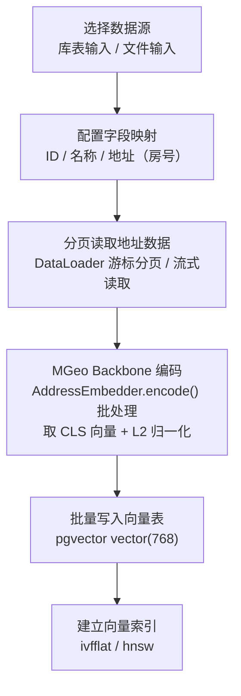
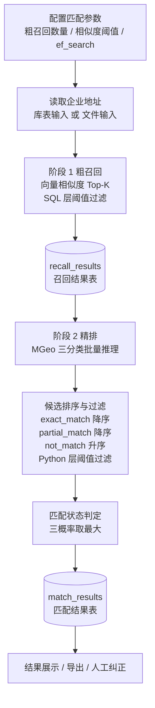
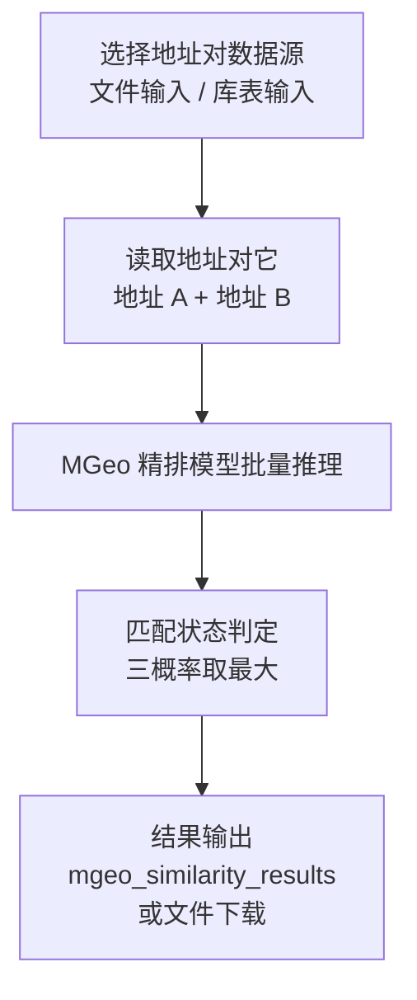
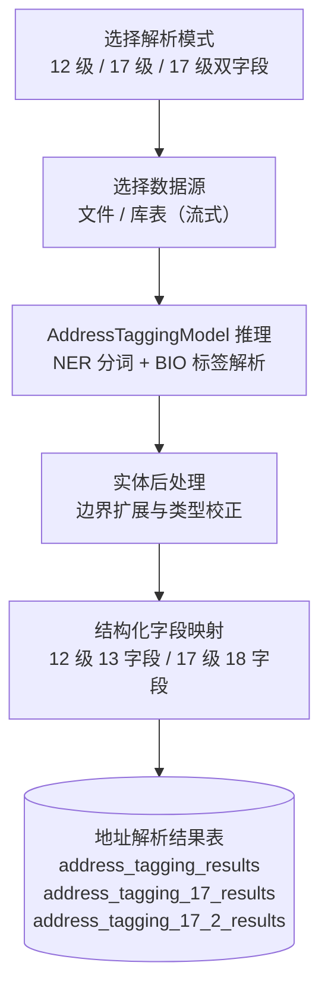

# 中文地址语义匹配系统 - 架构设计文档

## 一、系统架构概览


> 上图为分层架构概览：按「用户界面层 → 应用核心层 → 业务服务层 → 模型推理层 → 数据持久化层」自上而下组织，
> 箭头表示调用与依赖方向。
>
> 交互版源文件（支持明暗主题切换，可导出 PNG / JPEG / WebP / SVG / GIF）：
> [`docs/images/architecture-overview.html`](docs/images/architecture-overview.html)

## 二、模块职责

### 2.1 用户界面层 (app.py + pages/)

基于 Streamlit 构建的多页面 Web 界面，侧边栏提供七个功能入口：

| 页面 | 渲染函数 | 功能描述 |
| --- | --- | --- |
| 首页 | `show_home_page()` | 匹配工作流展示与功能入口卡片 |
| 数据库配置 | `show_db_config()` | PostgreSQL 连接配置、测试连接、查看数据表 |
| 地址结构化解析 | `show_address_tagging()` | 12 级 / 17 级 / 17 级双字段地址 NER 解析 |
| 向量预处理 | `show_vector_preprocess()` | 企业/标准地址向量化、建立向量索引 |
| 地址匹配 | `show_address_matching()` | 两个页签：数据粗召回 & MGeo 精确匹配、MGeo 地址相似度匹配 |
| 结果管理 | `show_result_management()` | 结果浏览、筛选、导出、人工纠正、匹配统计 |
| 系统日志 | `show_system_logs()` | 内存日志、数据库日志、向量调试测试 |

### 2.2 公共组件 (app_common.py)

集中管理跨页面共享的状态与缓存：

- `init_session_state()`：统一初始化所有页面共享状态（数据库配置、向量化配置、匹配配置、任务状态、标签状态、分页状态等）
- 缓存封装：`get_cached_embedder()` / `get_cached_mgeo_model()` / `get_cached_tagging_model()`（LRU 上限 2）、`_get_cached_db_connection()`（ttl=60）、`get_cached_tables()` / `get_cached_vector_tables()` / `get_cached_all_tags()`
- 公共 UI：`_render_device_selector()`、`_goto_page()` / `_prev_page()` / `_next_page()` 翻页回调、`_make_page_size_persist_callback()`
- 工具函数：`format_time()`、`detect_csv_encoding()`、`read_csv_with_encoding()`、`sync_matcher_status()`

### 2.3 配置模块 (config.py)

集中管理所有系统配置参数：

- `Config`：数据库连接、模型名称与路径、向量维度、表名、阈值、批处理大小
- `RuntimeConfig`：运行时参数（流式 chunk 大小、模型缓存上限、精排分块大小、fragment 轮询间隔）
- `_detect_gpu_info()`：综合 `torch.cuda.is_available()`、`nvidia-smi`、`torch.backends.cuda.is_built()` 三种方式检测 GPU
- `_find_model_local_path()`：多路径模型搜索（项目 `models/` → ModelScope 缓存 → HuggingFace 缓存）

### 2.4 数据库连接层 (database/connection.py)

`DBConnection` 类封装 PostgreSQL 数据库操作：

- 连接管理与自动重连（`_check_connection`）
- SQL 执行与参数化查询（`execute`）
- 事务管理（`commit` / `rollback`）
- 表结构查询（`get_tables` / `get_columns` / `table_exists` / `drop_table`）
- 查询取消（`get_backend_pid` / `cancel_current_query`）
- 自动设置 `search_path` 到用户指定的 Schema

`quote_identifier(name)` 对 SQL 标识符加双引号，支持中文表名与字段名。

### 2.5 数据加载层 (database/data_loader.py)

`DataLoader` 类提供数据读写操作：

- 数据加载：`load_enterprise_data` / `load_standard_addresses`（游标分页）、`load_unvectorized_*`（增量向量化）
- 向量表创建与数据插入（支持中文表名、自定义维度）
- 召回/匹配/相似度/结构化解析四类结果表的建表、写入、分页查询、统计与批量导出
- 原始表副本创建：`create_mgeo_copy_table` / `create_tagging_copy_table` 等，将匹配或解析结果回写到源表副本
- 人工纠正：`update_match_result_with_correction` / `batch_update_match_results_with_correction` / `direct_correct_match_result`
- 旧表自动迁移：`_add_correction_source_column`、`_migrate_float_to_double`、`_migrate_mgeo_similarity_add_identifier`、`_migrate_mgeo_similarity_add_extra_col`

### 2.6 向量存储层 (database/vector_store.py)

`VectorStore` 类封装 pgvector 向量检索：

- 向量表创建：`create_vector_table(table_type='enterprise'|'standard')`、`create_vector_table_with_dim()`
- 索引管理：`create_vector_index()`（支持 ivfflat / hnsw）、`_detect_vector_index_type()`、`check_index_exists()`、`drop_vector_index()`
- 检索参数调优：`get_recommended_ef_search()`（按表规模推荐 HNSW `ef_search`）、`_set_index_search_param()`
- 召回：`batch_recall()`（SQL LATERAL JOIN）、`batch_recall_streaming()`（大表流式召回）、`search_vectors()`
- 写入：`insert_vectors()`（事务批量提交 + 写入校验 `_verify_inserted_vectors`）
- 维护：`get_vector_count()` / `truncate_vector_table()` / `drop_vector_table()`

### 2.7 匹配引擎层 (matching/)

| 类 / 函数 | 文件 | 职责 |
| --- | --- | --- |
| `AddressMatcher` | matcher.py | 地址匹配主流程：粗召回 + 精排，支持同步/异步与任务控制 |
| `RankingEngine` | ranking.py | MGeo 精排：候选排序与匹配状态判定 |
| `MGeoSimilarityMatcher` | mgeo_similarity.py | 两地址直接相似度计算（独立功能） |
| `AddressTaggingParser` | address_tagging.py | 地址结构化解析业务封装（12/17/17-2 级） |
| `RuleBasedAddressTaggingEngine` | address_tagging_rules.py | 规则化地址解析引擎（房号等要素提取） |
| `determine_match_status()` | ranking.py / utils.py | 依据三分类概率判定匹配状态 |

**精排排序逻辑**（三级排序）：

1. 主排序：`exact_match` 降序
2. 次排序：`partial_match` 降序
3. 第三排序：`not_match` 升序

**匹配状态判断**：取三个概率中的最大值

- `exact_match` 最大 → 精确匹配
- `partial_match` 最大 → 部分匹配
- `not_match` 最大 → 不匹配
- 无候选 → 不匹配

**相似度阈值双重过滤**：

- 粗召回阶段：SQL `WHERE` 条件过滤
- 精排阶段：Python 代码过滤

### 2.8 模型层 (model/)

| 类 | 文件 | 职责 |
| --- | --- | --- |
| `BaseModelLoader` | base_model_loader.py | 模型加载基类：本地/在线、ModelScope/Transformers 统一加载 |
| `AddressEmbedder` | embedding.py | 地址向量化（粗召回模型），768 维输出 |
| `MGeoModel` | mgeo_model.py | 地址匹配三分类（精排模型） |
| `AddressTaggingModel` | address_tagging_model.py | 地址 NER 结构化解析（12 / 17 / 17-2 级） |

**模型加载策略**（优先级从高到低）：

1. 项目目录 `models/` 文件夹
2. ModelScope 缓存目录（`MODELSCOPE_CACHE` 可覆盖）
3. HuggingFace 缓存目录（`HF_HOME` 可覆盖）
4. 在线下载（modelscope → transformers，需 `trust_remote_code=True`）

**加载库优先级**：modelscope → transformers；加载时修复 checkpoint 键名映射（`bert.text_encoder.*` → `bert.*`）。

### 2.9 标签管理层 (database/tag_manager.py)

`TagManager` 类管理匹配标签：

- `create_tag(tag_name)`：创建标签（自动生成拼音前缀），同时创建关联的召回/匹配结果表
- `get_all_tags()` / `get_tag_by_prefix(prefix)`：查询标签
- `delete_tag(prefix)`：删除标签并级联删除关联数据表

### 2.10 工具层 (utils/)

| 模块 | 文件 | 职责 |
| --- | --- | --- |
| 日志 | logger.py | 内存日志 `StreamHandler` + 数据库日志 `DBLogHandler`，含 `setup_db_logging` / `get_db_logs` / `clear_db_logs` |
| 导出 | export.py | `export_to_excel` / `export_to_csv` / `export_statistics` |
| 拼音 | pinyin_utils.py | `tag_to_prefix` / `get_tag_tables` / `get_existing_tags` |
| 进度 | progress.py | `ProgressTracker` 进度跟踪与回调 |
| 异常 | exceptions.py | `AddressMatchError` / `DatabaseError` / `ModelInferenceError` / `OOMRiskError` / `ConfigError` |

### 2.11 启动器 (launcher.py)

Windows 一键启动：托管 Streamlit 子进程，记录 PID，关闭窗口时清理进程树，避免残留进程占用端口。配套 `地址匹配系统启动.bat` 供双击启动。

## 三、数据流

### 3.1 向量预处理流程


```mermaid
flowchart TD
    A["选择数据源<br/>库表输入 / 文件输入"] --> B["配置字段映射<br/>ID / 名称 / 地址（房号）"]
    B --> C["分页读取地址数据<br/>DataLoader 游标分页 / 流式读取"]
    C --> D["MGeo Backbone 编码<br/>AddressEmbedder.encode() 批处理<br/>取 CLS 向量 + L2 归一化"]
    D --> E["批量写入向量表<br/>pgvector vector(768)"]
    E --> F["建立向量索引<br/>ivfflat / hnsw"]
```

### 3.2 地址匹配流程


```mermaid
flowchart TD
    A["配置匹配参数<br/>粗召回数量 / 相似度阈值 / ef_search"] --> B["读取企业地址<br/>库表输入 或 文件输入"]
    B --> C["阶段 1 粗召回<br/>向量相似度 Top-K<br/>SQL 层阈值过滤"]
    C --> D[("recall_results<br/>召回结果表")]
    D --> E["阶段 2 精排<br/>MGeo 三分类批量推理"]
    E --> F["候选排序与过滤<br/>exact_match 降序<br/>partial_match 降序<br/>not_match 升序<br/>Python 层阈值过滤"]
    F --> G["匹配状态判定<br/>三概率取最大"]
    G --> H[("match_results<br/>匹配结果表")]
    H --> I["结果展示 / 导出 / 人工纠正"]
```

> 企业规模 ≥ 10 万时自动切换流式管线（`run_two_stage_pipeline_streaming`），分批召回与精排以控制内存占用。

### 3.3 MGeo 地址相似度流程


```mermaid
flowchart TD
    A["选择地址对数据源<br/>文件输入 / 库表输入"] --> B["读取地址对它<br/>地址 A + 地址 B"]
    B --> C["MGeo 精排模型批量推理"]
    C --> D["匹配状态判定<br/>三概率取最大"]
    D --> E["结果输出<br/>mgeo_similarity_results<br/>或文件下载"]
```

### 3.4 地址结构化解析流程


```mermaid
flowchart TD
    A["选择解析模式<br/>12 级 / 17 级 / 17 级双字段"] --> B["选择数据源<br/>文件 / 库表（流式）"]
    B --> C["AddressTaggingModel 推理<br/>NER 分词 + BIO 标签解析"]
    C --> D["实体后处理<br/>边界扩展与类型校正"]
    D --> E["结构化字段映射<br/>12 级 13 字段 / 17 级 18 字段"]
    E --> F[("地址解析结果表<br/>address_tagging_results<br/>address_tagging_17_results<br/>address_tagging_17_2_results")]
```

## 四、数据库表结构

### 4.1 向量表

**企业向量表** (`enterprise_vectors`)

| 字段 | 类型 | 说明 |
| --- | --- | --- |
| id | SERIAL | 主键 |
| source_id | VARCHAR(255) | 企业标识 |
| enterprise_name | TEXT | 企业名称 |
| address | TEXT | 企业地址 |
| vector | vector(768) | 地址向量（768 维） |
| created_at | TIMESTAMP | 创建时间 |

**标准地址向量表** (`standard_address_vectors`)

| 字段 | 类型 | 说明 |
| --- | --- | --- |
| id | SERIAL | 主键 |
| source_id | VARCHAR(255) | 标准地址编码 |
| address | TEXT | 标准地址 |
| room_no | VARCHAR(100) | 房屋编码 |
| vector | vector(768) | 地址向量（768 维） |
| created_at | TIMESTAMP | 创建时间 |

> 表名可在界面中自定义；向量维度由 `Config.VECTOR_DIM` 决定（默认 768）。

### 4.2 结果表

**粗召回结果表** (`recall_results`)

| 字段 | 类型 | 说明 |
| --- | --- | --- |
| id | SERIAL | 主键 |
| enterprise_id | VARCHAR(255) | 企业标识 |
| enterprise_name | TEXT | 企业名称 |
| enterprise_address | TEXT | 企业地址 |
| standard_id | VARCHAR(255) | 标准地址编码 |
| standard_address | TEXT | 标准地址 |
| room_no | VARCHAR(100) | 房屋编码 |
| similarity | DOUBLE PRECISION | 向量相似度 |
| created_at | TIMESTAMP | 创建时间 |

**精排匹配结果表** (`match_results`)

| 字段 | 类型 | 说明 |
| --- | --- | --- |
| id | SERIAL | 主键 |
| enterprise_id | VARCHAR(255) | 企业标识 |
| enterprise_name | TEXT | 企业名称 |
| enterprise_address | TEXT | 企业地址 |
| address_id | VARCHAR(255) | 匹配的标准地址编码 |
| standard_address | TEXT | 匹配的标准地址 |
| room_no | VARCHAR(100) | 房屋编码 |
| exact_match | DOUBLE PRECISION | 精确匹配概率 |
| partial_match | DOUBLE PRECISION | 部分匹配概率 |
| not_match | DOUBLE PRECISION | 不匹配概率 |
| match_status | VARCHAR(20) | 匹配状态 |
| correction_source | VARCHAR(20) | 纠正来源（自动匹配 / 人工纠正） |
| created_at | TIMESTAMP | 创建时间 |

**MGeo 相似度结果表** (`mgeo_similarity_results`)

| 字段 | 类型 | 说明 |
| --- | --- | --- |
| id | SERIAL | 主键 |
| address_a | TEXT | 地址 A |
| address_b | TEXT | 地址 B |
| exact_match | FLOAT | 精确匹配概率 |
| partial_match | FLOAT | 部分匹配概率 |
| not_match | FLOAT | 不匹配概率 |
| match_status | VARCHAR(20) | 匹配状态 |
| created_at | TIMESTAMP | 创建时间 |

> 该表还支持写入标识字段与附加列（通过迁移方法 `_migrate_mgeo_similarity_add_identifier` / `_migrate_mgeo_similarity_add_extra_col` 兼容旧表）。

**地址结构化解析结果表** (`address_tagging_results`，12 级)

| 字段 | 类型 | 说明 |
| --- | --- | --- |
| id | SERIAL | 主键 |
| original_address | TEXT | 原始地址 |
| province / city / district / street | VARCHAR | 省 / 城市 / 区划 / 街道 |
| community / road / roadno | VARCHAR | 社区 / 街路巷名 / 门楼牌号 |
| area / bldg / unit / floor / house | VARCHAR | 片区 / 建筑物 / 单元 / 楼层 / 户室号 |
| created_at | TIMESTAMP | 创建时间 |

**17 级解析结果表** (`address_tagging_17_results`)

| 字段 | 说明 |
| --- | --- |
| id / _id_field / dom_json | 主键、标识字段、结构化 JSON |
| original_address | 原始地址 |
| prov / city / district / town | 省 / 城市 / 区县 / 乡镇街道 |
| road / roadno / intersection | 道路名 / 路号 / 路口 |
| poi / subpoi | 兴趣点 / 子兴趣点 |
| houseno / cellno / floorno | 门牌号 / 单元号 / 楼层号 |
| community / assist / distance | 社区村庄 / 辅助信息 / 距离信息 |
| devzone / village_group | 开发区 / 村组 |
| created_at | 创建时间 |

**17 级双字段解析结果表** (`address_tagging_17_2_results`)：在上述 17 个要素字段基础上，每个要素再带一个 `_2` 副字段（共 34 个要素字段），首个匹配值写入主字段，后续同类型值拼接到副字段。

### 4.3 配置表与日志表

**标签配置表** (`match_tags`)

| 字段 | 类型 | 说明 |
| --- | --- | --- |
| id | SERIAL | 主键 |
| tag_name | VARCHAR(255) | 标签显示名 |
| prefix | VARCHAR(100) | 表名前缀（唯一） |
| recall_table | VARCHAR(255) | 关联召回结果表名 |
| match_table | VARCHAR(255) | 关联匹配结果表名 |
| created_at | TIMESTAMP | 创建时间 |

**应用日志表**（由 `DBLogHandler` 自动创建）：记录 `WARNING` 及以上级别的日志，字段包含级别、时间、模块、消息等。

> 以上表名为默认名称，实际表名由 `Config` 类中的配置决定，`DataLoader` 的方法支持 `table_name` 参数覆盖。
> 标签功能会为每个标签创建独立的 `{prefix}_recall_results` 和 `{prefix}_match_results` 表。
> 所有表均在连接时设定的 Schema 下创建（连接后自动 `SET search_path`）。

## 五、关键技术点

### 5.1 向量检索与索引

使用 pgvector 扩展实现向量相似度查询：

- 向量类型：`vector(768)`，余弦距离运算符 `<=>`
- 索引：支持 `ivfflat` 与 `hnsw` 两类索引，建表后可随时创建或重建
- HNSW 检索参数：`ef_search` 需不小于召回数量 Top-N，系统按表规模给出推荐值并写入会话配置
- 粗召回采用 `JOIN LATERAL` 子查询，为每个企业地址独立取 Top-K，避免全局排序

### 5.2 批处理策略

| 环节 | 参数 | 默认值 |
| --- | --- | --- |
| 数据库批量加载 | `BATCH_SIZE_DB` | 1000 |
| 向量化 | `BATCH_SIZE_EMBEDDING` | 256（GPU）/ 128（CPU） |
| 精排模型推理 | `BATCH_SIZE_MODEL` | 128（GPU）/ 64（CPU） |
| 精排分块 | `RuntimeConfig.RANKING_CHUNK_SIZE` | 5000 |
| 精排预测批 | `RuntimeConfig.RANKING_BATCH_SIZE` | 1000 |
| 流式召回批 | `RuntimeConfig.STREAMING_CHUNK_SIZE` | 5000 |
| 流式管线批 | `RuntimeConfig.STREAMING_BATCH_ENTERPRISE` | 1000 |
| 结果导出 | 每批 / 每工作表 | 5000 |

> 切流式管线的阈值：企业数 ≥ `STREAMING_THRESHOLD`（默认 100000）。

### 5.3 设备选择

系统自动检测 GPU 可用性：

- 检测到 NVIDIA 显卡且 CUDA 可用 → GPU 模式（自动启用 FP16 半精度推理）
- 检测到显卡但 PyTorch 为 CPU 版本 → 给出明确警告并回退 CPU
- 否则 → CPU 模式
- 用户可在界面中手动选择设备

### 5.4 Schema 隔离

- 连接数据库时自动执行 `SET search_path TO "{schema}", public`
- 所有表操作在指定 Schema 下执行
- 保留 `public` 模式以访问 pgvector 等扩展
- 支持中文表名（自动双引号引用）

### 5.5 标签隔离

- 每个标签有独立的召回表和匹配表
- 标签前缀由中文自动转拼音生成
- 删除标签级联删除关联数据表
- 结果管理支持按标签筛选

### 5.6 模型与连接缓存

- 模型实例缓存上限 `RuntimeConfig.MAX_MODEL_CACHE = 2`，超出按 LRU 淘汰（`_evict_oldest_model`）
- 数据库连接使用 `st.cache_resource(ttl=60)` 缓存，避免 Streamlit 每次 rerun 重建 TCP 连接
- 表列表、向量表列表、标签列表均有独立缓存，数据变更后调用 `invalidate_vector_tables_cache()` 失效

## 六、扩展性设计

### 6.1 模型替换

`BaseModelLoader` 封装了本地/在线、ModelScope/Transformers 的统一加载流程。子类只需实现：

- `_get_model_classes()`：返回模型与分词器类
- `_get_model_label()`：返回模型标识（用于日志）
- `_get_extra_load_kwargs()`（可选）：额外的加载参数

替换模型只需修改模型名称/路径与 `VECTOR_DIM`（需同步调整数据库向量表维度）。

### 6.2 数据库迁移

`DataLoader` 内置旧表迁移逻辑：

- 自动检测缺失字段并 `ALTER TABLE` 添加
- `FLOAT` → `DOUBLE PRECISION` 精度迁移
- 旧数据默认值处理（如 `correction_source='自动匹配'`）

### 6.3 新增匹配模式

在 `AddressMatcher` 中可扩展新的匹配策略：

- 修改候选排序逻辑（`RankingEngine`）
- 添加新的过滤条件
- 集成其他模型

## 七、文件结构

```
address_match/
├── app.py                          # 主应用入口（侧边栏路由 + 首页）
├── app_common.py                   # 公共组件：session_state、缓存、分页、CSV 编码探测
├── config.py                       # 系统配置（支持 .env）+ RuntimeConfig 运行时参数
├── ui_theme.py                     # UI 设计令牌与全局样式
├── launcher.py                     # 一键启动器（进程托管与清理）
├── 地址匹配系统启动.bat              # Windows 双击启动脚本
├── .env.example                    # 环境变量模板
├── requirements.txt                # Python 依赖
├── pytest.ini                      # pytest 配置
├── README.md                       # 项目说明
├── ARCHITECTURE.md                 # 架构设计文档
├── CODE_WIKI.md                    # 代码详解文档
├── DEPLOYMENT.md                   # 部署文档
├── OPERATION_MANUAL.md             # 使用说明文档
├── CLAUDE.md                       # 面向 AI 辅助开发的工程约定
│
├── database/                       # 数据库模块
│   ├── __init__.py
│   ├── connection.py               # 连接管理、自动重连、SQL 注入防护
│   ├── data_loader.py              # 数据加载与四类结果表管理
│   ├── vector_store.py             # 向量存储、索引与召回
│   └── tag_manager.py              # 标签管理
│
├── matching/                       # 匹配引擎
│   ├── __init__.py
│   ├── matcher.py                  # 两阶段匹配编排（线程安全、可暂停/停止）
│   ├── ranking.py                  # 精排引擎与状态判定
│   ├── mgeo_similarity.py          # MGeo 地址相似度匹配
│   ├── address_tagging.py          # 地址结构化解析业务封装
│   ├── address_tagging_rules.py    # 规则化地址解析引擎
│   └── utils.py                    # 匹配公共工具
│
├── model/                          # 模型层
│   ├── __init__.py
│   ├── base_model_loader.py        # 模型加载基类
│   ├── embedding.py                # 地址编码器（继承 BaseModelLoader）
│   ├── mgeo_model.py               # MGeo 分类模型（继承 BaseModelLoader）
│   └── address_tagging_model.py    # 地址结构化解析模型（继承 BaseModelLoader）
│
├── pages/                          # 页面模块
│   ├── __init__.py
│   ├── db_config.py                # 数据库配置页
│   ├── address_tagging.py          # 地址结构化解析页
│   ├── vector_preprocess.py        # 向量预处理页
│   ├── address_matching.py         # 地址匹配页（含两个页签）
│   ├── mgeo_similarity.py          # MGeo 地址相似度匹配页签
│   ├── result_management.py        # 结果管理页
│   └── system_logs.py              # 系统日志页
│
├── utils/                          # 工具模块
│   ├── __init__.py
│   ├── logger.py                   # 日志系统（内存 + 数据库）
│   ├── export.py                   # 导出工具
│   ├── pinyin_utils.py             # 拼音转换
│   ├── progress.py                 # 进度跟踪
│   └── exceptions.py               # 自定义异常体系
│
├── sql/                            # 房号提取存储过程与说明
│   ├── extract_house_number.sql
│   └── 提取房号解析存储过程.md
│
├── docs/                           # 补充资料（房号提取模式一览、脑图等）
├── tests/                          # pytest 测试用例
└── models/                         # 本地模型目录（可选，已 gitignore）
    └── iic/
        ├── mgeo_backbone_chinese_base/
        ├── mgeo_geographic_entity_alignment_chinese_base/
        └── mgeo_geographic_elements_tagging_chinese_base/
```
