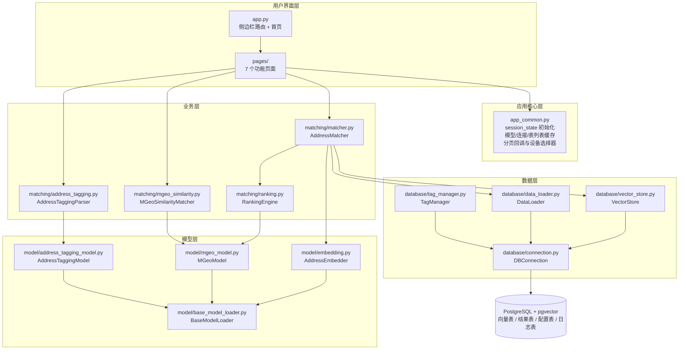
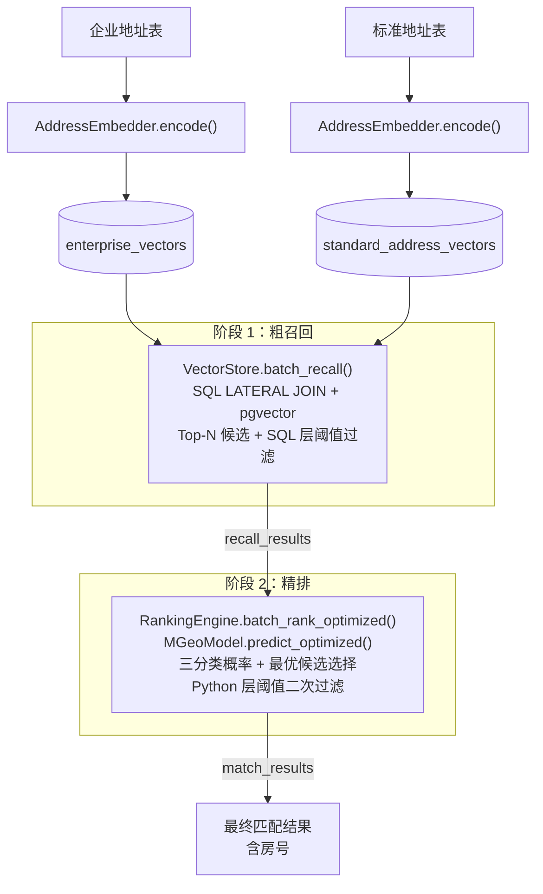
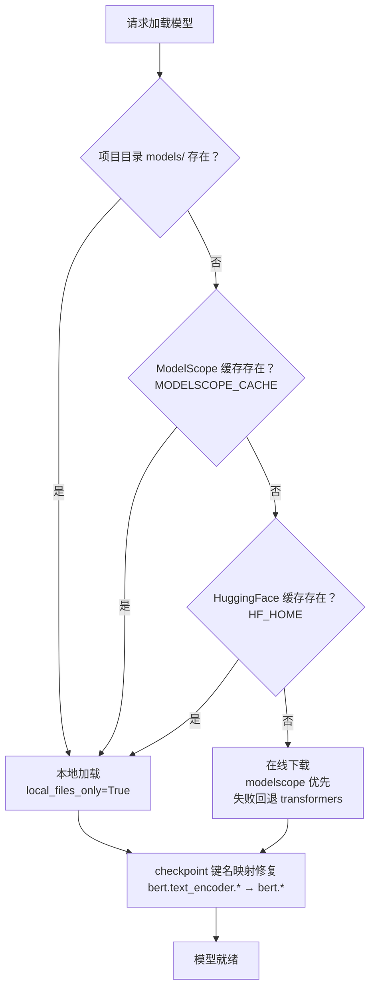
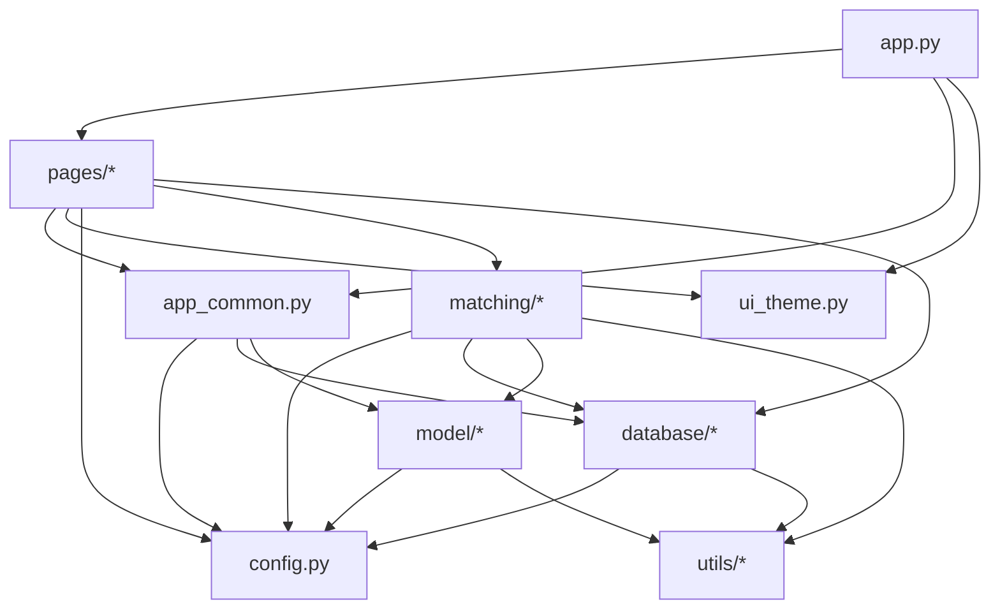
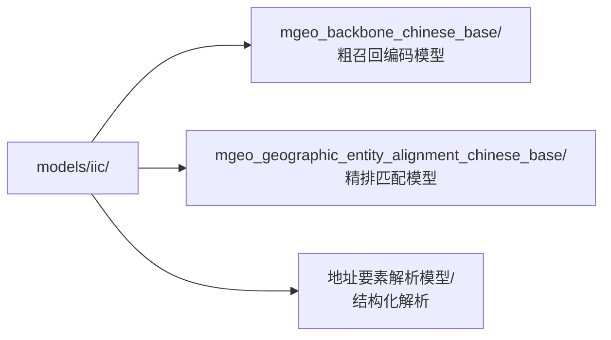
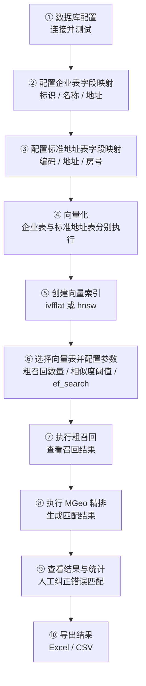

# 中文地址语义匹配系统 — Code Wiki

## 1. 项目概述

**项目名称**：中文地址语义匹配系统（address_match）

**项目目标**：实现 150 万企业表数据与 1300 万标准地址数据通过地址语义匹配，获取标准地址的房号信息。

**核心架构**：采用 **"粗召回 + 精排"** 两阶段匹配流程。

| 阶段 | 名称 | 技术 | 说明 |
| --- | --- | --- | --- |
| 阶段 1 | 粗召回 | MGeo Backbone 向量化 + pgvector LATERAL JOIN | 将地址编码为 768 维向量，按余弦相似度检索每个企业 Top-K 候选标准地址 |
| 阶段 2 | 精排 | MGeo Geographic Entity Alignment 模型 | 对候选地址对两两比较，输出三分类概率，选出最优匹配 |

**技术栈**：

- **前端**：Streamlit（Python Web UI 框架）
- **数据库**：PostgreSQL + pgvector 扩展（向量存储与检索）
- **AI 模型**：阿里 MGeo 预训练模型（ModelScope / HuggingFace）
  - 粗召回：`iic/mgeo_backbone_chinese_base`
  - 精排：`iic/mgeo_geographic_entity_alignment_chinese_base`
  - 地址解析：地址要素解析模型（NER）
- **后端**：Python（业务逻辑、数据处理）

---

## 2. 项目目录结构

```
address_match/
├── app.py                          # Streamlit 主应用入口 + 侧边栏路由
├── app_common.py                   # 公共组件：session_state、缓存、分页、编码探测
├── config.py                       # 全局配置（Config + RuntimeConfig）
├── ui_theme.py                     # UI 设计令牌系统（颜色、间距、排版）
├── launcher.py                     # 一键启动器（进程托管与清理）
├── 地址匹配系统启动.bat              # Windows 双击启动脚本
├── requirements.txt                # Python 依赖清单
├── pytest.ini                      # pytest 配置
├── database/                       # 数据库层
│   ├── __init__.py                 # 导出 DBConnection, VectorStore, DataLoader
│   ├── connection.py               # PostgreSQL 连接管理
│   ├── vector_store.py             # 向量存储与检索（pgvector）
│   ├── data_loader.py              # 数据批量加载与结果管理
│   └── tag_manager.py              # 标签管理（多任务隔离）
├── model/                          # 模型层
│   ├── __init__.py
│   ├── base_model_loader.py        # 统一本地/在线模型加载基类
│   ├── embedding.py                # 地址向量化（粗召回阶段）
│   ├── mgeo_model.py               # MGeo 精排模型（精排阶段）
│   └── address_tagging_model.py    # 地址 NER 结构化解析模型
├── matching/                       # 匹配层
│   ├── __init__.py
│   ├── matcher.py                  # 两阶段匹配流程编排 + 异步任务控制
│   ├── ranking.py                  # 精排引擎（候选排序与状态判定）
│   ├── mgeo_similarity.py          # MGeo 地址相似度匹配（独立功能）
│   ├── address_tagging.py          # 地址结构化解析业务封装
│   ├── address_tagging_rules.py    # 规则化地址解析引擎
│   └── utils.py                    # 匹配层公共工具
├── pages/                          # 页面模块（7 个页面）
│   ├── db_config.py
│   ├── address_tagging.py
│   ├── vector_preprocess.py
│   ├── address_matching.py
│   ├── mgeo_similarity.py
│   ├── result_management.py
│   └── system_logs.py
├── utils/                          # 工具层
│   ├── logger.py                   # 日志系统（内存 + 数据库）
│   ├── export.py                   # 数据导出（Excel/CSV）
│   ├── pinyin_utils.py             # 中文转拼音（标签命名）
│   ├── progress.py                 # 进度跟踪器
│   └── exceptions.py               # 自定义异常体系
├── sql/                            # 房号提取存储过程与说明
├── docs/                           # 补充资料
├── tests/                          # 测试用例（pytest）
└── models/                         # 本地模型目录（可选，已 gitignore）
```

---

## 3. 系统架构

### 3.1 整体架构图



### 3.2 两阶段匹配流程



### 3.3 数据流


1. **向量化阶段**：原始表 → `DataLoader` 分页加载 → `AddressEmbedder.encode()` → `VectorStore.insert_vectors()` 写入向量表
2. **粗召回阶段**：`enterprise_vectors` × `standard_address_vectors` → SQL LATERAL JOIN → `recall_results`
3. **精排阶段**：`recall_results` → `DataLoader` 加载 → `MGeoModel` 批量预测 → `RankingEngine` 排序 → `match_results`

---

## 4. 模块详解

### 4.1 config.py — 全局配置

**职责**：集中管理系统的所有配置参数。

**关键类与函数**：

| 名称 | 类型 | 说明 |
| --- | --- | --- |
| `Config` | 类 | 全局配置类，所有参数为类属性，支持 `.env` 覆盖 |
| `RuntimeConfig` | 类 | 运行时参数（流式批大小、模型缓存上限、精排分块等） |
| `_detect_gpu_info()` | 函数 | 增强 GPU 检测，综合 torch.cuda、nvidia-smi、torch.backends 三种方式 |
| `_find_model_local_path(model_name)` | 函数 | 多路径模型搜索：项目目录 → ModelScope 缓存 → HuggingFace 缓存 |

**核心配置项**：

| 配置项 | 默认值 | 说明 |
| --- | --- | --- |
| `DB_HOST` / `DB_PORT` | localhost / 5432 | PostgreSQL 连接参数（可用 `.env` 覆盖） |
| `DB_NAME` / `DB_USER` / `DB_SCHEMA` | 见 `.env.example` | 库名 / 用户名 / 模式名 |
| `EMBEDDING_MODEL_NAME` | iic/mgeo_backbone_chinese_base | 粗召回向量化模型 |
| `MODEL_NAME` | iic/mgeo_geographic_entity_alignment_chinese_base | 精排匹配模型 |
| `DEVICE` | 自动检测 | 运行设备（cuda / cpu） |
| `VECTOR_DIM` | 768 | 向量维度 |
| `SIMILARITY_THRESHOLD` | 0.8 | 相似度阈值（代码级默认，界面可覆盖） |
| `RECALL_TOP_N` | 50 | 每个企业粗召回候选数量（代码级默认，界面可覆盖） |
| `BATCH_SIZE_DB` | 1000 | 数据库批量加载大小 |
| `BATCH_SIZE_EMBEDDING` | 256（GPU）/ 128（CPU） | 向量化批处理大小 |
| `BATCH_SIZE_MODEL` | 128（GPU）/ 64（CPU） | 精排模型批处理大小 |
| `LOG_LEVEL` | WARNING | 日志级别 |

**RuntimeConfig 运行时参数**：

| 配置项 | 默认值 | 说明 |
| --- | --- | --- |
| `FRAGMENT_POLL_INTERVAL` | 3 | Streamlit fragment 轮询间隔（秒） |
| `STREAMING_CHUNK_SIZE` | 5000 | 流式召回每批企业数量 |
| `STREAMING_BATCH_ENTERPRISE` | 1000 | 流式管线每批处理企业数 |
| `STREAMING_THRESHOLD` | 100000 | 超过该企业数自动使用流式管线 |
| `MAX_MODEL_CACHE` | 2 | 模型实例缓存上限（LRU 淘汰） |
| `RANKING_CHUNK_SIZE` | 5000 | 精排每 chunk 处理的企业数 |
| `RANKING_BATCH_SIZE` | 1000 | 精排模型预测批次大小 |

**模型加载策略**（多路径回退）：



---

### 4.2 app_common.py — 公共组件

**职责**：集中管理跨页面共享的会话状态、缓存与 UI 组件。

| 函数 | 说明 |
| --- | --- |
| `init_session_state()` | 统一初始化所有页面共享状态（DB 配置、向量化/匹配配置、任务状态、标签、分页） |
| `_get_cached_db_connection(...)` | 缓存 `DBConnection` 实例（`st.cache_resource(ttl=60)`） |
| `get_cached_embedder(device)` | 缓存 `AddressEmbedder` 实例 |
| `get_cached_mgeo_model(device)` | 缓存 `MGeoModel` 实例 |
| `get_cached_tagging_model(device)` | 缓存 `AddressTaggingModel` 实例 |
| `_evict_oldest_model()` | 模型缓存超限时按 LRU 淘汰 |
| `get_cached_tables(...)` / `get_cached_vector_tables(...)` | 缓存数据表 / 向量表列表 |
| `invalidate_vector_tables_cache()` | 向量表变更后使缓存失效 |
| `get_cached_all_tags(...)` / `_tags_tuple_to_list(...)` | 缓存标签列表并转为列表 |
| `_render_device_selector(key)` | 渲染 GPU/CPU 设备选择器 |
| `_goto_page` / `_prev_page` / `_next_page` | 分页回调（解决 widget 绑定后无法改 session_state 的问题） |
| `_make_page_size_persist_callback(key)` / `_restore_page_size(key)` | 每页条数持久化 |
| `format_time(seconds)` | 格式化耗时显示 |
| `detect_csv_encoding(file_bytes)` / `read_csv_with_encoding(file)` | CSV 编码自动探测与读取 |
| `sync_matcher_status(matcher, status_dict)` | 将后台 matcher 状态同步到 session_state |

**关键设计**：session_state 中 `matching_config` 的界面默认值为 `recall_top_n=10`、`similarity_threshold=0.7`、`ef_search=None`（由系统按所选向量表自动推荐）。

---

### 4.3 database/ — 数据库层

#### 4.3.1 connection.py — 数据库连接管理

**关键类与方法**：

| 方法 | 说明 |
| --- | --- |
| `connect()` | 建立连接，注册 pgvector、设置 `search_path` |
| `execute(sql, params)` | 执行 SQL，支持自动重连 |
| `get_tables()` / `get_columns(table)` / `table_exists(table)` | 表结构查询 |
| `drop_table(table)` | 删除表 |
| `commit()` / `rollback()` / `get_cursor()` | 事务与游标管理 |
| `get_backend_pid()` / `cancel_current_query()` | 获取后端 PID 并取消长查询 |
| `test_connection()` | 连接测试 |

**关键函数**：`quote_identifier(name)` — 对 SQL 标识符加双引号，支持中文表名和字段名。

**技术要点**：

- 连接后自动执行 `SET search_path TO "{schema}", public`，保留 `public` 以访问 pgvector 扩展
- 使用 `RealDictCursor` 返回字典形式查询结果
- 自动重连机制（`_check_connection` + `connect` 回退）

#### 4.3.2 vector_store.py — 向量存储与检索

**关键方法**：

| 方法 | 说明 |
| --- | --- |
| `create_vector_table(table_name, table_type)` | 创建向量表（`enterprise` / `standard` 两种结构） |
| `create_vector_table_with_dim(table_name, dim, type)` | 按指定维度创建向量表 |
| `create_vector_index(table_name, index_name, index_type)` | 创建向量索引（ivfflat / hnsw） |
| `_detect_vector_index_type(table_name)` | 检测现有索引类型（hnsw / ivfflat / none） |
| `get_recommended_ef_search(table_name, top_n)` | 按表规模推荐 HNSW `ef_search` |
| `_set_index_search_param(table_name, top_n, ef_search)` | 设置会话级检索参数 |
| `insert_vectors(vectors, source_ids, ...)` | 批量插入向量（事务批量提交 + 回写校验） |
| `batch_recall(enterprise_table, standard_table, top_n, threshold)` | **核心方法**：批量粗召回（SQL LATERAL JOIN） |
| `batch_recall_streaming(...)` | 大表流式召回 |
| `search_vectors(query_vector, top_n)` | 单向量相似性搜索 |
| `get_vector_count()` / `truncate_vector_table()` / `drop_vector_table()` | 向量表维护 |

**粗召回 SQL 核心逻辑**（`batch_recall`）：

```sql
SELECT c.source_id, a.source_id, 1 - (c.vector <=> a.vector) AS similarity
FROM enterprise_vectors c
JOIN LATERAL (
    SELECT source_id, address, room_no, vector
    FROM standard_address_vectors
    ORDER BY c.vector <=> vector
    LIMIT {top_n}
) a ON true
WHERE 1 - (c.vector <=> a.vector) >= {threshold}
ORDER BY c.source_id, similarity DESC
```

**性能优化**：

- `_vector_to_pg_string()` / `_vectors_to_pg_strings()`：numpy 向量化构建向量字符串，比逐元素拼接快 10-20x
- 批量插入时临时关闭 autocommit，按 chunk 提交事务
- 写入后抽样校验（`_verify_inserted_vectors`）确保落库成功

#### 4.3.3 data_loader.py — 数据加载与结果管理

**关键方法（按功能分组）**：

| 分组 | 方法 | 说明 |
| --- | --- | --- |
| 数据加载 | `load_enterprise_data` / `load_standard_addresses` | 游标分页加载（避免深度分页性能问题） |
| 增量向量化 | `get_unvectorized_count` / `load_unvectorized_*` | 仅加载尚未向量化的记录 |
| 统计 | `get_total_count` / `get_valid_address_count` | 总数与有效地址数 |
| 召回结果 | `create_recall_table` / `insert_recall_results` / `load_recall_results` / `get_recall_results_paginated` | 召回结果表管理与读取 |
| 匹配结果 | `create_result_table` / `insert_match_results` / `get_match_results_paginated` / `get_match_statistics` | 匹配结果表管理与统计 |
| 人工纠正 | `update_match_result_with_correction` / `batch_update_match_results_with_correction` / `direct_correct_match_result` / `batch_direct_correct_match_results` | 单条与批量纠正 |
| 相似度结果 | `create_mgeo_similarity_table` / `insert_mgeo_similarity_results` / `get_mgeo_similarity_statistics` | MGeo 相似度结果管理 |
| 结构化解析 | `create_address_tagging_table` / `create_address_tagging_17_table` / `create_address_tagging_17_2_table` 及配套 insert/查询/统计/导出 | 12 级、17 级、17 级双字段三套结果表 |
| 源表副本 | `create_mgeo_copy_table` / `create_tagging_copy_table_from_result` / `create_tagging_17_copy_table_from_result` 等 | 将结果回写为源表副本 |
| 导出 | `export_recall_results_batch` / `export_match_results_batch` / `export_mgeo_similarity_results_batch` / `export_address_tagging*_batch` | 分批导出，默认每批 5000 条 |
| 迁移 | `_add_correction_source_column` / `_migrate_float_to_double` / `_migrate_mgeo_similarity_add_identifier` / `_migrate_mgeo_similarity_add_extra_col` | 旧表结构自动迁移 |

**通用方法抽取**：`_generic_truncate_table` / `_generic_get_count` / `_generic_get_paginated` / `_generic_get_statistics` / `_generic_export_batch` 为各类结果表提供统一的清空、分页、统计与导出实现。

**技术要点**：

- 游标分页（`id > last_id`）替代 OFFSET 分页，避免深度分页性能衰减
- `CREATE TABLE IF NOT EXISTS` 不会修改已有表列类型，因此精度与字段变更需显式迁移

#### 4.3.4 tag_manager.py — 标签管理

| 方法 | 说明 |
| --- | --- |
| `_ensure_config_table()` | 确保标签配置表存在 |
| `create_tag(tag_name)` | 创建标签，同时创建关联的召回/匹配结果表 |
| `get_all_tags()` / `get_tag_by_prefix(prefix)` | 查询标签 |
| `delete_tag(prefix)` | 删除标签及其关联数据表 |

**标签机制**：每个标签对应一对数据表（`{prefix}_recall_results`、`{prefix}_match_results`），实现不同批次/区域的匹配数据隔离。

---

### 4.4 model/ — 模型层

#### 4.4.1 base_model_loader.py — 模型加载基类

`BaseModelLoader` 统一处理本地/在线、ModelScope/Transformers 的加载流程。子类需实现：

| 方法 | 必需 | 说明 |
| --- | --- | --- |
| `_get_model_classes()` | 是 | 返回模型类与分词器类 |
| `_get_model_label()` | 是 | 返回模型标识（用于日志） |
| `_get_extra_load_kwargs()` | 否 | 额外加载参数 |

内部流程：`_try_load_from_local(local_path)` → `_try_load_from_model_name()` → `_fix_checkpoint_key_mapping()` → `_check_cuda_and_set_seed()`。

#### 4.4.2 embedding.py — 地址向量化（粗召回阶段）

| 方法 | 说明 |
| --- | --- |
| `encode(texts, batch_size, max_len)` | 批量向量化，返回 (n, 768) numpy 数组 |
| `get_embedding(address)` | 获取单个地址向量 |
| `get_vector_dim()` | 获取向量维度 |

**向量化流程**：

1. Tokenizer 编码文本（`truncation=True`，`max_length=64`）
2. 取 `last_hidden_state[:, 0, :]`（[CLS] token）
3. L2 归一化（`torch.nn.functional.normalize`，余弦距离依赖归一化向量）

#### 4.4.3 mgeo_model.py — MGeo 精排模型（精排阶段）

| 方法 | 说明 |
| --- | --- |
| `predict(address_pairs, batch_size)` | 批量预测，返回完整结果（含地址对和标签） |
| `predict_optimized(address_pairs, batch_size)` | **高性能版**：精简结果，仅保留概率值 |
| `get_similarity(address1, address2)` | 获取两个地址的匹配概率 |
| `batch_predict(addresses1, addresses2)` | 批量预测两组地址 |

**模型输出标签映射**：

| 索引 | 标签名 | 说明 |
| --- | --- | --- |
| 0 | not_match | 不匹配概率 |
| 1 | partial_match | 部分匹配概率 |
| 2 | exact_match | 精确匹配概率 |

**重要约束**：模型加载时必须 `num_labels=3`，否则 `AutoModelForSequenceClassification` 默认 2 标签会导致 logits 维度不匹配。

**性能优化**：

- GPU 上自动启用 FP16 半精度推理（`model.half()`），速度提升约 2x
- 使用 `torch.inference_mode()` 替代 `torch.no_grad()`
- `predict_optimized()`：预分配结果列表、批量 numpy 切片、精简结果字典

#### 4.4.4 address_tagging_model.py — 地址结构化解析模型

| 方法 | 说明 |
| --- | --- |
| `predict(addresses, batch_size)` | 12 级结构化解析 |
| `predict_17(addresses, batch_size)` | 17 级结构化解析（保留原始 NER 标签） |
| `predict_17_2(addresses, batch_size)` | 17 级双字段解析（主字段 + `_2` 副字段） |
| `_parse_bio_tags(tokens, label_ids)` | BIO 标签序列解析 |
| `_post_process_entities` / `_expand_entity_boundaries` | 实体后处理与边界扩展 |
| `_ner_to_structured` / `_ner_to_structured_17` / `_ner_to_structured_17_2` | NER 结果到结构化字段的映射 |
| `_build_dom_json(entity_list, address)` | 生成结构化 JSON（`dom_json`） |

**12 级输出字段**（13 个）：`province`、`city`、`district`、`street`、`community`、`road`、`roadno`、`area`、`bldg`、`unit`、`floor`、`house`（外加 `original_address`）。

**17 级输出字段**（17 个）：`prov`、`city`、`district`、`town`、`road`、`roadno`、`intersection`、`poi`、`subpoi`、`houseno`、`cellno`、`floorno`、`community`、`assist`、`distance`、`devzone`、`village_group`。

---

### 4.5 matching/ — 匹配层

#### 4.5.1 matcher.py — 两阶段匹配流程编排

| 方法 | 说明 |
| --- | --- |
| `run_full_pipeline(...)` | 运行完整匹配流程（粗召回 + 精排） |
| `run_two_stage_pipeline(...)` | 两阶段匹配核心方法 |
| `run_two_stage_pipeline_streaming(...)` | 大表流式两阶段匹配 |
| `build_enterprise_vectors(...)` | 构建企业向量 |
| `build_standard_vectors(...)` | 构建标准地址向量 |
| `match_batch(df)` | 单批企业数据匹配 |
| `start_async(...)` | 异步启动完整匹配 |
| `start_recall_async(...)` | 异步启动粗召回（分步模式） |
| `start_ranking_async(...)` | 异步启动精排（分步模式） |
| `pause()` / `resume()` / `stop()` / `get_status()` / `set_threshold()` | 任务控制与状态查询 |

**两阶段流程**：

1. **粗召回**：`VectorStore.batch_recall()` → `DataLoader.insert_recall_results()`
2. **精排**：`RankingEngine.batch_rank_optimized()` → `DataLoader.insert_match_results()`

**分步执行模式**：支持先执行粗召回、查看召回结果后再执行精排。

#### 4.5.2 ranking.py — 精排引擎

| 名称 | 类型 | 说明 |
| --- | --- | --- |
| `RankingEngine` | 类 | 精排引擎 |
| `rank(query_address, candidates)` | 方法 | 单条地址精排 |
| `batch_rank(query_addresses, candidates_list)` | 方法 | 批量精排 |
| `batch_rank_optimized(recall_results, ...)` | 方法 | **优化版批量精排**：分块处理避免 OOM |
| `determine_match_status(exact, partial, not_match)` | 函数 | 依据三分类概率判断匹配状态 |

**候选排序逻辑**：

1. 先按相似度阈值过滤低分候选
2. 主排序：`exact_match` 降序
3. 次排序：`partial_match` 降序
4. 第三排序：`not_match` 升序

**匹配状态判断**：

- `exact_match` 最大 → **精确匹配**
- `partial_match` 最大 → **部分匹配**
- `not_match` 最大 → **不匹配**
- 无候选 → **不匹配**

**`batch_rank_optimized` 分块策略**：

- 每次处理 `chunk_size`（默认 5000）个企业
- 收集该块内所有地址对，一次性送入模型预测
- 预测完成后立即释放内存，再处理下一块
- 避免一次性加载所有地址对（150 万企业 × 50 候选 = 7500 万对）导致 OOM

#### 4.5.3 mgeo_similarity.py — MGeo 地址相似度匹配（独立功能）

| 名称 | 类型 | 说明 |
| --- | --- | --- |
| `MGeoSimilarityMatcher` | 类 | MGeo 地址相似度匹配器 |
| `match_from_dataframe(df, col_a, col_b)` | 方法 | 从 DataFrame 匹配 |
| `match_from_file(file_path, col_a, col_b)` | 方法 | 从文件匹配（Excel/CSV） |
| `match_from_db_streaming(db_conn, table, ...)` | 方法 | 从数据库表流式匹配 |
| `run_mgeo_similarity_async(...)` | 函数 | 异步执行匹配任务 |

**与两阶段匹配的区别**：此模块不依赖向量召回，直接对用户提供的地址对进行匹配，适用于已有地址对需判断是否匹配的场景。

#### 4.5.4 address_tagging.py — 地址结构化解析封装

| 名称 | 类型 | 说明 |
| --- | --- | --- |
| `AddressTaggingParser` | 类 | 解析器（按 `mode` 支持 12 / 17 / 17-2 级） |
| `parse_from_dataframe(df, address_col, ...)` | 方法 | 从 DataFrame 解析 |
| `parse_from_file(file_path, address_col, ...)` | 方法 | 从文件解析 |
| `parse_from_db_table(...)` | 方法 | 从数据库表解析 |
| `parse_from_db_streaming(...)` | 方法 | 从数据库表流式解析（大表） |
| `output_fields` / `output_field_labels` / `level_name` | 属性 | 输出字段与层级元信息 |
| `run_address_tagging_async(...)` | 函数 | 异步执行解析任务 |

#### 4.5.5 address_tagging_rules.py — 规则化地址解析引擎

`RuleBasedAddressTaggingEngine` 基于正则与规则实现地址要素切分，主要用于房号（`house`）等尾部要素的高精度提取，是 `sql/extract_house_number.sql` 存储过程的规则来源。

---

### 4.6 pages/ — 页面模块

| 页面 | 主要函数 | 说明 |
| --- | --- | --- |
| 数据库配置 | `show_db_config()` | 连接参数表单、测试连接、表清单展示 |
| 地址结构化解析 | `show_address_tagging()`、`_show_address_tagging_panel(mode)` | 三个页签（17 级 / 12 级 / 17 级双字段），库表与文件输入 |
| 向量预处理 | `show_vector_preprocess()`、`run_vectorization_background(...)`、`run_index_creation_background(...)` | 后台线程向量化、索引创建、状态 fragment 刷新 |
| 地址匹配 | `show_address_matching()`、`start_recall_matching(...)`、`start_mgeo_ranking(...)`、`start_streaming_matching(...)` | 两个页签：数据粗召回 & MGeo 精确匹配、MGeo 地址相似度匹配 |
| MGeo 相似度 | `show_mgeo_similarity_matching(...)`、`start_mgeo_similarity_matching(...)` | 作为地址匹配页的第二个页签渲染 |
| 结果管理 | `show_result_management()` | 召回/匹配/相似度/三类解析结果的浏览、筛选、分页、导出、人工纠正、统计图表 |
| 系统日志 | `show_system_logs()`、`run_vector_debug_test()` | 内存日志、数据库日志、向量调试测试 |

**页面实现共性**：

- 长任务通过后台线程执行，主线程用 `st.fragment` 定时局部刷新进度（不整页 rerun）
- 分页与每页条数通过 `app_common` 的回调函数管理
- 向量表、表列表、标签列表走统一缓存，变更后主动失效

---

### 4.7 utils/ — 工具层

#### 4.7.1 logger.py

| 名称 | 类型 | 说明 |
| --- | --- | --- |
| `logger` | Logger | 全局日志器（`address_matcher`） |
| `StreamHandler` | 类 | 内存缓存日志处理器，供 UI 展示 |
| `DBLogHandler` | 类 | 数据库日志处理器（单例），WARNING 及以上写入数据库 |
| `setup_db_logging(db_conn)` | 函数 | 初始化数据库日志 |
| `get_log_messages()` / `clear_logs()` | 函数 | 内存日志读取与清空 |
| `get_db_logs(db_conn, limit, level)` / `clear_db_logs(db_conn)` | 函数 | 数据库日志读取与清空 |

#### 4.7.2 export.py

| 函数 | 说明 |
| --- | --- |
| `export_to_excel(df, file_path)` | 导出 DataFrame 到 Excel |
| `export_to_csv(df, file_path)` | 导出 DataFrame 到 CSV（UTF-8 BOM） |
| `export_statistics(statistics, file_path)` | 导出统计信息 |

#### 4.7.3 pinyin_utils.py

| 函数 | 说明 |
| --- | --- |
| `tag_to_prefix(tag)` | 中文→拼音，英文→小写清理 |
| `get_tag_tables(prefix)` | 生成 `{prefix}_recall_results` 与 `{prefix}_match_results` 表名 |
| `get_existing_tags(db_conn)` | 从数据库检索已有标签前缀 |

#### 4.7.4 progress.py

`ProgressTracker`：进度跟踪器，支持 `update()`、`get_status()`、`reset()` 与回调注册 `add_callback()`。

#### 4.7.5 exceptions.py

| 异常类 | 说明 |
| --- | --- |
| `AddressMatchError` | 项目异常基类 |
| `DatabaseError` | 数据库相关异常 |
| `ModelInferenceError` | 模型推理异常 |
| `OOMRiskError` | 显存/内存不足风险 |
| `ConfigError` | 配置错误 |

---

### 4.8 sql/ — 房号提取存储过程

将项目中的房号解析逻辑下沉到 PostgreSQL，可直接在大表上批量执行。

| 对象 | 签名 | 说明 |
| --- | --- | --- |
| `extract_house_number` | `(p_address TEXT) RETURNS TEXT`，`IMMUTABLE` | 房号提取核心函数，无匹配返回空串 |
| `batch_update_house_number` | `(p_table_name, p_id_col, p_address_col, p_house_col, p_batch_size, p_where_clause)` | 批量更新存储过程 |

**用法示例**：

```sql
-- 单条测试
SELECT extract_house_number('广东省深圳市福田区华强北街道华航社区振兴路91-13号B101');
-- 返回: B101

-- 批量更新大表
CALL batch_update_house_number(
    p_table_name   := 'public.enterprise_address',
    p_id_col       := 'id',
    p_address_col  := 'address',
    p_house_col    := 'house_no',
    p_batch_size   := 5000,
    p_where_clause := ''
);
```

**性能设计**：采用 `ctid` keyset pagination 分批处理，避免大表更新时越跑越慢。
详细规则分析与验证记录见 `sql/提取房号解析存储过程.md`。

---

### 4.9 ui_theme.py — UI 设计令牌系统

| 类 | 说明 |
| --- | --- |
| `Colors` | 语义化颜色令牌（主色调、状态色、中性色、分区色） |
| `Spacing` | 8px 基准间距系统 |
| `Typography` | 排版令牌（字体、字号、字重） |
| `Radius` / `Shadow` | 圆角与阴影令牌 |
| `Icons` | 语义图标标签 |

| 函数 | 说明 |
| --- | --- |
| `card_style(bg_color, border_color)` | 生成卡片容器 CSS |
| `status_container_style(status_type)` | 生成语义状态容器样式 |
| `inject_global_styles()` | 注入全局 Streamlit 自定义样式（每次 rerun 需重新注入） |

---

### 4.10 launcher.py — 一键启动器

负责启动并托管 Streamlit 进程：

- 启动前清理残留进程，避免端口占用
- 记录子进程 PID，窗口关闭时终止整个进程树
- 配合 `地址匹配系统启动.bat`（使用 `%~dp0` 自动定位目录）供双击启动

---

## 5. 依赖关系

### 5.1 模块间依赖关系图



**说明**：

- `config.py` 与 `utils/` 为底层依赖，不反向依赖上层模块
- `database/` 依赖 `config` 与 `utils`，不依赖 `model` 与 `matching`
- `model/` 仅依赖 `config` 与 `utils`
- `matching/` 编排 `database` 与 `model`
- `pages/` 通过 `app_common` 获取缓存与公共组件，避免重复创建模型与连接

### 5.2 外部依赖

| 依赖 | 版本 | 用途 |
| --- | --- | --- |
| streamlit | 1.38.0 | Web UI 框架 |
| psycopg2-binary | 2.9.11 | PostgreSQL 驱动 |
| pgvector | 0.4.2 | 向量数据库扩展的 Python 支持 |
| modelscope | 1.35.4 | ModelScope 模型库（优先加载） |
| transformers | 5.5.3 | HuggingFace 模型库（回退加载） |
| sentence-transformers | 5.4.0 | 句向量模型支持 |
| torch | 见 requirements.txt | PyTorch 深度学习框架 |
| numpy | 2.4.4 | 数值计算 |
| pandas | 2.3.3 | 数据处理 |
| scikit-learn | 1.8.0 | 机器学习工具 |
| openpyxl | 3.1.5 | Excel 文件读写 |
| pypinyin | 0.55.0 | 中文转拼音 |
| python-dotenv | 1.2.2 | `.env` 配置加载 |
| pytest | 9.1.0 | 单元测试框架 |
| tqdm | 4.67.3 | 进度条 |

---

## 6. 项目运行方式

### 6.1 环境准备

```bash
# 1. 创建并激活虚拟环境
python -m venv venv
venv\Scripts\activate          # Windows
# source venv/bin/activate     # Linux/macOS

# 2. 安装 Python 依赖（推荐国内镜像）
pip install -r requirements.txt -i https://pypi.tuna.tsinghua.edu.cn/simple
```

数据库侧需确保：

```sql
CREATE EXTENSION IF NOT EXISTS vector;
CREATE SCHEMA IF NOT EXISTS ai;   -- 如需非 public 模式
```

### 6.2 模型准备

系统启动时会自动搜索本地模型或在线下载。推荐提前下载模型到项目目录：



```
address_match/
└── models/
    └── iic/
        ├── mgeo_backbone_chinese_base/                      # 粗召回模型
        ├── mgeo_geographic_entity_alignment_chinese_base/   # 精排模型
        └── （地址要素解析模型目录）                          # 结构化解析
```

### 6.3 启动应用

```bash
# 方式一：直接启动
streamlit run app.py

# 方式二：使用一键启动器（自动托管进程）
python launcher.py

# 方式三：Windows 双击
地址匹配系统启动.bat
```

### 6.4 使用流程



### 6.5 运行测试

```bash
# 运行全部测试
pytest tests/

# 运行单个测试文件
pytest tests/test_vector_store_rename.py

# 运行单个测试用例
pytest tests/test_vector_store_rename.py::TestVectorStoreRename::test_rename
```

> `pytest.ini` 已配置 `testpaths = tests`，并忽略 `archive`、`.git`、`venv`、`__pycache__` 目录。

---

## 7. 关键设计决策

### 7.1 相似度阈值双重过滤

阈值在两个阶段均生效：

- **粗召回阶段**：SQL `WHERE similarity >= threshold` 在数据库层面过滤
- **精排阶段**：Python 代码中再次过滤，防止粗召回阶段漏过滤的候选进入精排

界面默认阈值为 0.7（`Config.SIMILARITY_THRESHOLD` 代码级默认为 0.8，界面值优先）。

### 7.2 人工纠正机制

- `match_results` 表有 `correction_source` 字段（默认 `'自动匹配'`）
- 人工纠正后更新为 `'人工纠正'`
- 支持单条纠正与批量直接纠正（`batch_direct_correct_match_results`）
- 系统启动时自动检测旧表并迁移添加该字段

### 7.3 多 Schema 支持

- 连接后自动执行 `SET search_path TO "{schema}", public`
- 保留 `public` 模式以访问 pgvector 扩展
- `quote_identifier()` 对 SQL 标识符加双引号，支持中文表名和字段名

### 7.4 标签隔离机制

- 每个标签对应独立的 recall / match 数据表
- 标签名自动转拼音作为表名前缀
- 支持不同批次/区域的匹配数据隔离

### 7.5 GPU 检测与回退

- 综合三种方式检测 GPU：`torch.cuda.is_available()`、`nvidia-smi`、`torch.backends.cuda.is_built()`
- 检测到 NVIDIA 显卡但 PyTorch 为 CPU 版本时给出明确警告
- GPU 上自动启用 FP16 半精度推理

### 7.6 大表流式处理

- 企业数 ≥ `STREAMING_THRESHOLD`（默认 10 万）时自动切换流式管线
- 流式召回与流式精排均按块处理，块处理完立即释放内存
- 向量化支持增量模式（仅处理未向量化记录）

### 7.7 HNSW 检索参数自适应

- 自动检测向量表索引类型
- 非 HNSW 索引时界面禁用 `ef_search` 控件并给出提示
- HNSW 索引时按表规模推荐 `ef_search`，且下限不低于粗召回数量（HNSW 硬性要求）

### 7.8 翻页回调机制

结果管理页面分页使用 Streamlit 的 `on_click` 回调（`_goto_page`、`_prev_page`、`_next_page`），解决 widget 绑定后无法直接修改 `session_state` 的问题。

---

## 8. 数据库表总览

| 表名 | 说明 | 创建位置 |
| --- | --- | --- |
| `enterprise_vectors` | 企业地址向量表 | VectorStore |
| `standard_address_vectors` | 标准地址向量表 | VectorStore |
| `recall_results` | 粗召回结果表 | DataLoader |
| `match_results` | 匹配结果表（含人工纠正字段） | DataLoader |
| `mgeo_similarity_results` | MGeo 相似度匹配结果表 | DataLoader |
| `address_tagging_results` | 地址 12 级结构化解析结果表 | DataLoader |
| `address_tagging_17_results` | 地址 17 级结构化解析结果表 | DataLoader |
| `address_tagging_17_2_results` | 地址 17 级双字段解析结果表 | DataLoader |
| `{prefix}_recall_results` | 标签特定的召回结果表 | TagManager + DataLoader |
| `{prefix}_match_results` | 标签特定的匹配结果表 | TagManager + DataLoader |
| `{source_table}_mgeo` | 原始表的 MGeo 匹配副本 | DataLoader |
| `{source_table}_tagging` / `_tagging_17` | 原始表的解析结果副本 | DataLoader |
| `match_tags` | 标签配置表 | TagManager |
| （应用日志表） | WARNING 及以上日志持久化 | DBLogHandler |

---

## 9. 测试用例说明

测试位于 `tests/`，使用 pytest 运行。按主题分类：

| 主题 | 代表测试文件 | 测试内容 |
| --- | --- | --- |
| 向量表与索引 | `test_ef_search.py`、`test_vector_store_rename.py`、`test_vector_store_verify_sql.py`、`test_vector_table_detail.py`、`test_custom_vector_table_name.py` | HNSW 检索参数、向量表重命名与校验、自定义表名 |
| 向量表映射与切换 | `test_vec_table_mapping.py`、`test_vec_table_switch_fix.py` | 源表与向量表映射、切换回显 |
| 向量预处理 | `test_vector_preprocess_cache_fix.py`、`test_vector_preprocess_completion_refresh.py`、`test_vector_preprocess_optimize.py`、`test_vector_preprocess_source_filter.py`、`test_vectorize_performance.py` | 缓存修复、完成状态刷新、源表过滤、性能 |
| 流式管线 | `test_streaming_pipeline.py`、`test_ranking_e2e.py` | 流式召回与端到端精排 |
| 房号提取 | `test_pg_house_*.py`（v1-v9）、`test_py_house_*.py`（v2-v9）、`test_pg_house_extraction*.py`、`test_verify_17_levels.py` | PG 存储过程与 Python 规则引擎的房号提取一致性对比 |
| 地址结构化解析 | `test_address_tagging_completion.py`、`test_address_tagging_rules.py`、`test_address_tagging_streaming.py`、`test_mgeo_tagging_model.py` | 解析完整性、规则引擎、流式解析、模型推理 |
| MGeo 模型与相似度 | `test_mgeo_optimize.py`、`test_mgeo_similarity_extra_col.py` | 精排性能优化、附加列支持 |
| 数据加载与匹配 | `test_data_loader_alias_fix.py`、`test_source_id_type_fix.py`、`test_order_by_stability.py`、`test_matching_utils.py` | 字段别名、类型修复、排序稳定性、匹配工具 |

> `tests/` 下另有 `debug_*.py`、`bench_*.py`、`analyze_v4_failures.py` 等调试与基准脚本，以及 `tests/archive/` 归档目录，均不会被 pytest 自动收集。
