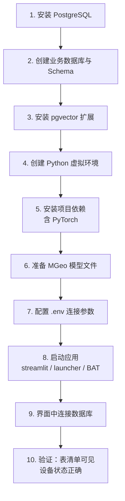
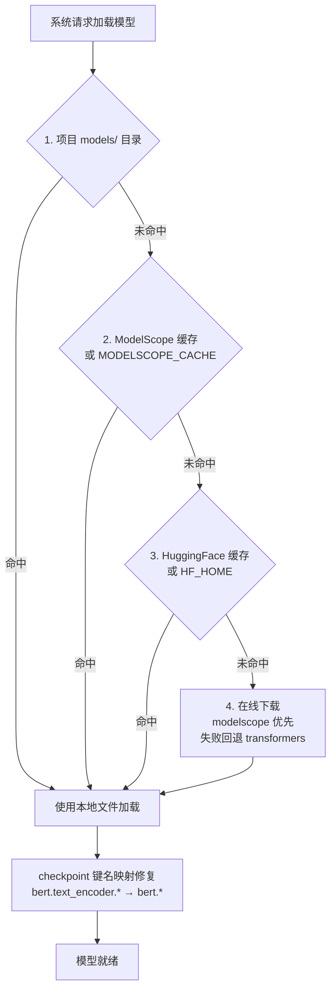

# 中文地址语义匹配系统 - 部署文档

## 一、系统环境要求

### 硬件要求

- **CPU 模式**：4 核以上 CPU，16GB 以上内存
- **GPU 模式**：NVIDIA GPU（支持 CUDA），8GB 以上显存，16GB 以上内存

### 软件要求

| 组件 | 要求 |
| --- | --- |
| Python | 3.10 及以上（开发环境 3.12） |
| PostgreSQL | 14 及以上 |
| pgvector | 0.4 及以上（Python 端依赖 `pgvector==0.4.2`） |
| PyTorch | 见 `requirements.txt`（开发环境为 CUDA 13.0 版本） |

## 二、部署流程概览



## 三、环境部署步骤

### 3.1 安装 PostgreSQL 与 pgvector

#### Windows 系统

1. 下载 PostgreSQL 安装包：https://www.postgresql.org/download/windows/
2. 运行安装程序，按提示完成安装
3. 安装 pgvector 扩展（需下载对应版本的 pgvector 二进制并放入 PostgreSQL 的 `lib` 与 `share/extension` 目录），随后执行：

```powershell
psql -U postgres -d postgres -c "CREATE EXTENSION vector;"
```

#### Linux 系统（Ubuntu/Debian）

```bash
sudo apt update
sudo apt install postgresql postgresql-client
sudo apt install postgresql-14-pgvector
psql -U postgres -d postgres -c "CREATE EXTENSION vector;"
```

### 3.2 创建业务数据库与 Schema

```sql
-- 以 postgres 超级用户连接
psql -U postgres

-- 1. 创建业务数据库（按实际项目命名，例如 prj_sj_db）
CREATE DATABASE your_db;

-- 2. 切换到业务库
\c your_db

-- 3. 启用 pgvector 扩展
CREATE EXTENSION IF NOT EXISTS vector;

-- 4. 如需使用非 public 模式，提前创建
CREATE SCHEMA IF NOT EXISTS ai;
```

> **重要**：`CREATE EXTENSION vector` 必须在**业务库**中执行。
> 系统连接后会自动 `SET search_path TO "{schema}", public`，业务表创建在指定 Schema 下，同时保留 `public` 以访问 pgvector 扩展。

### 3.3 安装 Python 依赖

1. 创建虚拟环境：

```bash
python -m venv venv
```

2. 激活虚拟环境：

- Windows：`venv\Scripts\activate`
- Linux/macOS：`source venv/bin/activate`

3. 安装依赖（推荐国内镜像加速）：

```bash
pip install -r requirements.txt -i https://pypi.tuna.tsinghua.edu.cn/simple
```

> **关键依赖说明**：
> - `python-dotenv`：支持 `.env` 文件配置，用于管理数据库连接等环境变量
> - `pgvector`：PostgreSQL 向量扩展的 Python 驱动
> - `modelscope` / `transformers`：MGeo 模型加载与推理
> - `openpyxl`：Excel 导入导出

> **PyTorch 说明**：`requirements.txt` 中的 `torch` 指向本地 wheel 文件
> （`torch-2.11.0+cu130-cp312-cp312-win_amd64.whl`）。若该文件缺失或与本机环境不匹配，
> 请自行安装合适版本：
> ```bash
> # CUDA 版本
> pip install torch --index-url https://download.pytorch.org/whl/cu130
> # 仅 CPU
> pip install torch --index-url https://download.pytorch.org/whl/cpu
> ```
> 系统会自动检测 GPU 并选择运行模式，无需手动配置。

### 3.4 下载 MGeo 模型

系统使用多个 MGeo 模型，支持多种方式部署模型文件。

#### 方式 1：项目目录部署（推荐，适合离线部署）

将模型文件放置在项目目录的 `models/` 文件夹下：

```
address_match/
├── models/
│   └── iic/
│       ├── mgeo_backbone_chinese_base/                     ← 粗召回模型
│       │   ├── config.json
│       │   ├── pytorch_model.bin
│       │   ├── tokenizer.json
│       │   └── ...
│       ├── mgeo_geographic_entity_alignment_chinese_base/  ← 精排模型
│       │   ├── config.json
│       │   ├── pytorch_model.bin
│       │   ├── tokenizer.json
│       │   └── ...
│       └── （地址要素解析模型目录）                          ← 结构化解析模型
│           └── ...
```

模型下载地址：

- 粗召回模型：https://www.modelscope.cn/models/iic/mgeo_backbone_chinese_base
- 精排模型：https://www.modelscope.cn/models/iic/mgeo_geographic_entity_alignment_chinese_base

#### 方式 2：ModelScope 缓存目录

首次运行时系统会自动从网络下载模型到缓存目录：

```
~/.cache/modelscope/hub/models/iic/mgeo_backbone_chinese_base/
~/.cache/modelscope/hub/models/iic/mgeo_geographic_entity_alignment_chinese_base/
```

也可通过环境变量指定缓存目录：

```bash
# Windows
set MODELSCOPE_CACHE=D:\modelscope_cache

# Linux/macOS
export MODELSCOPE_CACHE=/data/modelscope_cache
```

#### 方式 3：在线下载

如果网络可以访问 ModelScope 或 HuggingFace，系统会自动在线下载模型（约 1.5GB）。



### 3.5 配置数据库连接

系统支持两种配置方式，二者可配合使用。

#### 方式 A：`.env` 文件预配置（推荐）

复制项目根目录的 `.env.example` 为 `.env`，按实际环境填写：

```env
DB_HOST=localhost
DB_PORT=5432
DB_NAME=your_db
DB_USER=postgres
DB_PASSWORD=your_password_here
DB_SCHEMA=public
```

> `.env` 中的配置仅作为【数据库配置】页面的默认值自动填入，仍需在界面中确认并连接。
> **请勿将 `.env` 提交到版本控制**（项目 `.gitignore` 已忽略）。

#### 方式 B：界面配置

在【数据库配置】页面填写：

- **数据库主机**：数据库服务器地址
- **端口**：PostgreSQL 端口（默认 5432）
- **数据库名**：业务数据库名称
- **模式（Schema）**：数据库模式名（默认 public，可自定义如 ai）
- **用户名** / **密码**：数据库账号

> **重要**：连接数据库后，系统会自动设置 `search_path` 到用户指定的 Schema，
> 所有表操作（创建向量表、召回结果表等）都会在该 Schema 下执行。
> 同时保留 `public` 模式以访问 pgvector 等扩展。

## 四、启动程序

```bash
# 激活虚拟环境
source venv/bin/activate  # Linux/macOS
venv\Scripts\activate     # Windows

# 方式一：直接启动 Streamlit
streamlit run app.py

# 方式二：使用一键启动器（自动托管进程，关闭窗口即清理子进程）
python launcher.py
```

Windows 用户也可直接双击项目根目录的 `地址匹配系统启动.bat`。

启动后访问 http://localhost:8501 即可使用系统。

> 系统启动后会在界面侧边栏显示当前运行模式（GPU/CPU），如检测到 NVIDIA 独立显卡将自动使用 GPU 加速。

## 五、数据库表结构

系统运行时会自动在用户指定的 Schema 下创建以下表。

### 5.1 向量表

**enterprise_vectors（企业向量表）**

| 字段 | 类型 | 说明 |
| --- | --- | --- |
| id | SERIAL | 主键 |
| source_id | VARCHAR(255) | 企业标识（NOT NULL） |
| enterprise_name | TEXT | 企业名称 |
| address | TEXT | 企业地址（NOT NULL） |
| vector | vector(768) | 地址向量（NOT NULL） |
| created_at | TIMESTAMP | 创建时间，默认当前时间 |

**standard_address_vectors（标准地址向量表）**

| 字段 | 类型 | 说明 |
| --- | --- | --- |
| id | SERIAL | 主键 |
| source_id | VARCHAR(255) | 标准地址编码（NOT NULL） |
| address | TEXT | 标准地址（NOT NULL） |
| room_no | VARCHAR(100) | 房屋编码 |
| vector | vector(768) | 地址向量（NOT NULL） |
| created_at | TIMESTAMP | 创建时间，默认当前时间 |

### 5.2 结果表

**recall_results（粗召回结果表）**

| 字段 | 类型 | 说明 |
| --- | --- | --- |
| id | SERIAL | 主键 |
| enterprise_id | VARCHAR(255) | 企业标识 |
| enterprise_name | TEXT | 企业名称 |
| enterprise_address | TEXT | 企业地址 |
| standard_id | VARCHAR(255) | 标准地址编码 |
| standard_address | TEXT | 标准地址 |
| room_no | VARCHAR(100) | 房屋编码 |
| similarity | DOUBLE PRECISION | 向量相似度 |
| created_at | TIMESTAMP | 创建时间 |

**match_results（精排匹配结果表）**

| 字段 | 类型 | 说明 |
| --- | --- | --- |
| id | SERIAL | 主键 |
| enterprise_id | VARCHAR(255) | 企业标识 |
| enterprise_name | TEXT | 企业名称 |
| enterprise_address | TEXT | 企业地址 |
| address_id | VARCHAR(255) | 匹配的标准地址编码 |
| standard_address | TEXT | 匹配的标准地址 |
| room_no | VARCHAR(100) | 房屋编码 |
| exact_match | DOUBLE PRECISION | 精确匹配概率 |
| partial_match | DOUBLE PRECISION | 部分匹配概率 |
| not_match | DOUBLE PRECISION | 不匹配概率 |
| match_status | VARCHAR(20) | 匹配状态（精确匹配/部分匹配/不匹配） |
| correction_source | VARCHAR(20) | 纠正来源（自动匹配/人工纠正），默认"自动匹配" |
| created_at | TIMESTAMP | 创建时间 |

**mgeo_similarity_results（MGeo 地址相似度匹配结果表）**

| 字段 | 类型 | 说明 |
| --- | --- | --- |
| id | SERIAL | 主键 |
| address_a | TEXT | 地址 A |
| address_b | TEXT | 地址 B |
| exact_match | FLOAT | 精确匹配概率 |
| partial_match | FLOAT | 部分匹配概率 |
| not_match | FLOAT | 不匹配概率 |
| match_status | VARCHAR(20) | 匹配状态 |
| created_at | TIMESTAMP | 创建时间 |

**地址结构化解析结果表**（三套）

| 表名 | 说明 |
| --- | --- |
| `address_tagging_results` | 12 级解析结果（省/市/区/街道/社区/道路/门牌/片区/建筑物/单元/楼层/户室号） |
| `address_tagging_17_results` | 17 级解析结果（保留模型原始 NER 标签） |
| `address_tagging_17_2_results` | 17 级双字段解析结果（每个要素含主字段与 `_2` 副字段） |

### 5.3 配置表与日志表

**match_tags（标签配置表）**

| 字段 | 类型 | 说明 |
| --- | --- | --- |
| id | SERIAL | 主键 |
| tag_name | VARCHAR(255) | 标签显示名 |
| prefix | VARCHAR(100) | 表名前缀（唯一） |
| recall_table | VARCHAR(255) | 关联召回结果表名 |
| match_table | VARCHAR(255) | 关联匹配结果表名 |
| created_at | TIMESTAMP | 创建时间 |

**应用日志表**：由 `DBLogHandler` 自动创建，持久化 `WARNING` 及以上级别日志。

> **注意**：以上表名为默认名称，实际表名由 `Config` 类中的配置决定。
> `DataLoader` 的方法支持 `table_name` 参数覆盖默认表名。
> 标签功能会为每个标签创建独立的 `{prefix}_recall_results` 和 `{prefix}_match_results` 表。

## 六、精排匹配逻辑说明

MGeo 精排模型输出三个概率值：`exact_match`（精确匹配）、`partial_match`（部分匹配）、`not_match`（不匹配）。

**候选排序逻辑**（三级）：

1. **主排序**：`exact_match` 降序（越高越好）
2. **次排序**：`partial_match` 降序（越高越好）
3. **第三排序**：`not_match` 升序（越低越好）

**匹配状态判断**：取三个概率中最大值决定匹配状态

- `exact_match` 最大 → 精确匹配
- `partial_match` 最大 → 部分匹配
- `not_match` 最大 → 不匹配
- 无候选 → 不匹配

### 相似度阈值过滤

相似度阈值在两个阶段均生效，实现双重过滤：

1. **粗召回阶段**：SQL `WHERE` 条件过滤，在数据库层面排除向量相似度低于阈值的候选
2. **精排阶段**：Python 代码中再次过滤，确保即使粗召回未过滤，精排阶段仍可按阈值过滤

> 阈值设为 0 表示不过滤，保留所有候选；阈值越高，过滤越严格。
> 界面默认阈值 0.7，可在【地址匹配】页面调整。

### HNSW 检索参数（ef_search）

- 若标准地址向量表使用 HNSW 索引，界面会出现 `ef_search` 参数，系统按表规模自动推荐
- `ef_search` 下限不低于粗召回数量 Top-N（HNSW 硬性要求）
- 若使用 ivfflat 或未建索引，该参数自动禁用并给出提示

## 七、部署检查清单

| 检查项 | 预期结果 |
| --- | --- |
| PostgreSQL 服务 | 可连接，`SELECT version()` 正常返回 |
| pgvector 扩展 | 业务库中 `CREATE EXTENSION vector` 成功 |
| Python 依赖 | `pip install -r requirements.txt` 无报错 |
| PyTorch | `python -c "import torch; print(torch.__version__)"` 正常 |
| 模型文件 | `models/iic/` 下模型目录完整，或缓存目录存在 |
| `.env` | 位于项目根目录，参数与目标库一致 |
| 应用启动 | 访问 http://localhost:8501 正常打开 |
| 设备状态 | 侧边栏显示 GPU 或 CPU 模式 |
| 数据库连接 | 界面显示"数据库已连接"，表清单可见 |

## 八、常见问题

### Q1: 模型加载失败

- **项目目录部署**：确认模型文件放置在 `address_match/models/iic/` 目录下且结构完整
- **缓存目录部署**：确保模型已下载到 `~/.cache/modelscope/hub/models/iic/` 目录
- **环境变量**：通过 `MODELSCOPE_CACHE` 环境变量指定模型缓存目录
- **在线下载**：可配置国内镜像 `export HF_ENDPOINT="https://hf-mirror.com"`
- **查看日志**：【系统日志】页面会显示详细的模型搜索和加载过程

### Q2: 非 public 模式下创建向量表失败

- 确保在【数据库配置】页面填写了正确的模式名（Schema）
- 系统会自动设置 `search_path`，所有表操作在指定 Schema 下执行
- 支持中文表名，系统会自动对 SQL 标识符进行双引号引用

### Q3: CUDA 不可用

- 确保安装了 NVIDIA 驱动和 CUDA Toolkit
- 安装 GPU 版 PyTorch：`pip install torch --index-url https://download.pytorch.org/whl/cu130`
- 若检测到显卡但 PyTorch 为 CPU 版本，界面会给出明确警告，系统自动回退 CPU 模式运行

### Q4: 内存不足

- 减小批处理参数（向量预处理页面的处理批次大小）
- 使用 CPU 模式运行（显存不足时）
- 超大表建议使用流式管线（企业数 ≥ 10 万时系统自动切换）

### Q5: MGeo 精排结果全部为 0

- 确认模型加载时指定了 `num_labels=3`
- 检查日志中是否有 "index 2 is out of bounds" 错误
- 确认模型文件完整，特别是配置文件中包含 `id2label` 配置

### Q6: session_state 报错

- 确保使用最新版本代码，已内置 session_state 初始化保护
- 翻页功能已使用 `on_click` 回调机制，解决 widget 绑定后无法修改 session_state 的问题
- 如仍出现报错，尝试清除浏览器缓存后重新访问

### Q7: 相似度阈值不起作用

- 阈值已在粗召回和精排两个阶段生效
- 粗召回阶段：SQL `WHERE` 条件过滤
- 精排阶段：Python 代码过滤
- 若阈值为 0，则等价于不过滤

### Q8: MGeo 相似度匹配文件输入结果如何获取

- 文件输入模式下，匹配结果不会写入数据库
- 匹配完成后页面会显示"下载 Excel 格式"和"下载 CSV 格式"两个下载按钮
- 点击即可将匹配结果保存到本地

### Q9: 旧数据库缺少 correction_source 字段

- 系统启动时会自动检测并迁移旧表，添加 `correction_source` 字段
- 无需手动执行 `ALTER TABLE`，系统自动处理
- 旧数据默认 `correction_source='自动匹配'`

### Q10: 标签功能如何使用

- 在【地址匹配】页面先选择或创建标签
- 标签用于隔离不同批次的匹配数据，每个标签有独立的召回表和匹配表
- 删除标签时会同时删除关联的数据表
- 在【结果管理】页面可按标签筛选查看对应数据

### Q11: `.env` 文件配置不生效

- 确认 `.env` 文件位于项目根目录（与 `app.py` 同级）
- 确认文件名为 `.env`（非 `.env.txt` 或其他变体）
- 确认环境变量名拼写正确：`DB_HOST`、`DB_PORT`、`DB_NAME`、`DB_USER`、`DB_PASSWORD`、`DB_SCHEMA`
- 确认文件中无多余空格或引号，正确格式为 `KEY=VALUE`
- 修改 `.env` 后需要重启应用才会生效
- 如仍不生效，检查 `python-dotenv` 是否已安装：`pip show python-dotenv`

### Q12: 地址结构化解析模型加载失败

- 地址结构化解析模型（`AddressTaggingModel`）使用 MGeo backbone 作为基础模型
- 如果粗召回模型已成功加载，结构化解析模型通常也能正常加载（共用同一基础模型）
- 检查模型文件是否完整，参考 Q1 的排查步骤
- 查看系统日志中 `AddressTaggingModel` 的加载过程，确认是否有报错信息

### Q13: 向量预处理中途失败或重复处理

- 向量预处理支持增量模式，系统会跳过已向量化的记录
- 若中途失败，重新执行即可从断点继续
- 如需全量重跑，可先清空对应向量表
