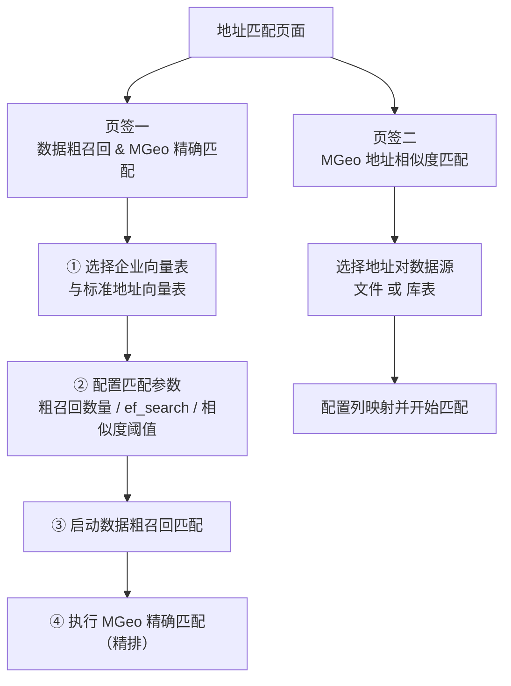
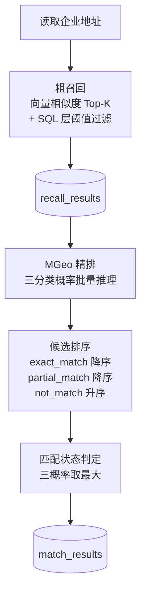

# 中文地址语义匹配系统 - 使用说明

## 一、系统概述

本系统是一个基于深度学习和向量检索的中文地址语义匹配平台，主要功能包括：

- **地址结构化解析**：对地址文本进行 NER 分词，提取省、市、区、街道、房号等结构化信息
- **向量预处理**：将企业地址和标准地址转换为向量并存储到数据库，支持建立向量索引
- **地址匹配**：支持库表输入和文件输入两种模式，实现企业地址与标准地址的两阶段智能匹配
- **MGeo 地址相似度**：直接比较两个地址文本的相似度
- **结果管理**：查看、筛选、导出匹配结果，支持人工纠正
- **系统日志**：查看实时日志和数据库存储日志，支持向量调试测试

### 整体工作流


## 二、界面导航

系统左侧导航栏包含七个主要功能模块：

| 序号 | 模块 | 说明 |
| --- | --- | --- |
| 1 | 首页 | 系统功能导航入口，展示匹配工作流和功能卡片 |
| 2 | 数据库配置 | 连接 PostgreSQL 数据库 |
| 3 | 地址结构化解析 | 对地址文本进行 NER 分词，提取结构化要素 |
| 4 | 向量预处理 | 生成和存储地址向量，建立向量索引 |
| 5 | 地址匹配 | 执行地址匹配任务（两个页签） |
| 6 | 结果管理 | 查看和管理匹配结果 |
| 7 | 系统日志 | 查看日志和运行调试测试 |

侧边栏同时显示当前数据库连接状态与运行设备（GPU / CPU）。

## 三、功能详解

### 3.1 数据库配置

首次使用系统前，需要先配置数据库连接。

**操作步骤**：

1. 在左侧导航栏点击"数据库配置"
2. 填写数据库连接信息：
   - **数据库主机**：PostgreSQL 服务器地址（默认 localhost）
   - **端口**：数据库端口（默认 5432）
   - **数据库名**：业务数据库名称
   - **模式（Schema）**：数据库模式名（默认 public，可自定义如 ai）
   - **用户名** / **密码**：数据库账号
3. 点击"连接数据库"按钮
4. 连接成功后，系统会自动设置 `search_path`，并可在页面中查看数据表

**.env 文件预配置**：

系统支持通过项目根目录下的 `.env` 文件预配置数据库连接参数，配置后会作为数据库配置页面的默认值自动填入：

- `DB_HOST` - 数据库主机
- `DB_PORT` - 数据库端口
- `DB_NAME` - 数据库名称
- `DB_USER` - 数据库用户名
- `DB_PASSWORD` - 数据库密码
- `DB_SCHEMA` - 数据库模式名

可参考项目中的 `.env.example` 文件创建 `.env` 文件：

```env
DB_HOST=localhost
DB_PORT=5432
DB_NAME=your_db
DB_USER=postgres
DB_PASSWORD=your_password_here
DB_SCHEMA=public
```

**注意事项**：

- 连接成功后，系统会自动设置 `search_path` 到用户指定的 Schema，所有表操作在该 Schema 下执行
- 支持中文表名，系统会自动对 SQL 标识符进行双引号引用
- 连接成功后左侧导航栏会显示"数据库已连接"状态
- `.env` 中的配置仅作为默认值，仍需在界面中点击连接按钮

### 3.2 地址结构化解析

地址结构化解析功能使用 MGeo 门址地址结构化要素解析模型，对地址文本进行 NER 分词，提取省、市、区、街道等结构化信息。

**功能说明**：

- 基于阿里 MGeo 地址要素解析模型
- 对地址文本进行命名实体识别（NER），将地址拆分为结构化要素
- 支持三种解析精度模式，以三个页签呈现：

| 模式 | 输出说明 |
| --- | --- |
| **地址 17 级分词（MGeo）** | 保留模型原始 NER 标签，共 17 个要素：省、城市、区/县、乡镇/街道、道路名、路号、路口、兴趣点、子兴趣点、门牌号/楼栋号、单元号、楼层号、社区/村庄、辅助信息、距离信息、开发区、村组 |
| **地址 12 级分词** | 合并映射后的结构化输出，共 12 类要素：省、城市、区划、街道、社区、道路名、门牌号、片区、建筑物、单元、楼层、户室号 |
| **地址 17 级分词（MGeo）2** | 每个 NER 标签对应主字段和副字段（`_2` 后缀），首个匹配值写入主字段，后续同类型值拼接到副字段 |

**操作步骤**：

1. 在左侧导航栏点击"地址结构化解析"
2. 选择解析精度页签
3. 选择输入模式：
   - **库表输入**：选择包含地址的数据库表、地址列名，以及标识列名（17 级模式建议指定）
   - **文件输入**：上传 CSV 或 Excel 文件，选择地址列名与标识列名
4. 配置设备（CPU / GPU）
5. 点击"开始解析"按钮

**结果存储**：

- 12 级解析结果存储到 `address_tagging_results` 表
- 17 级解析结果存储到 `address_tagging_17_results` 表
- 17 级双字段解析结果存储到 `address_tagging_17_2_results` 表
- 文件输入模式下，解析结果以文件形式下载

**注意事项**：

- 首次使用时模型需要下载，请确保网络通畅
- 17 级双字段模式适用于同一地址中包含多个同类要素的场景（如多个兴趣点）
- 大表采用流式解析，处理过程中可查看实时进度
- 解析结果可在【结果管理】页面查看和导出

### 3.3 向量预处理

向量预处理是将企业地址和标准地址转换为向量并存储到数据库的过程，是后续匹配的基础。

**操作步骤**：

1. 在左侧导航栏点击"向量预处理"
2. 选择向量表类型：
   - **企业向量表**：存储企业地址的向量
   - **标准地址向量表**：存储标准地址的向量
3. 配置数据源：
   - **库表输入**：选择数据库表、地址列名、ID 列名，以及企业名称列（企业表可选）
   - **文件输入**：上传 CSV 或 Excel 文件并配置列映射
4. 配置向量生成参数：
   - **处理批次大小**：每次处理的地址数量（默认 1000，范围 100-10000）
   - **设备**：CPU 或 GPU（系统会自动检测 GPU 可用性）
5. 点击"开始生成向量"按钮
6. 向量生成完成后，可继续**创建向量索引**：
   - 选择索引类型（`hnsw` 或 `ivfflat`）
   - 如选择 `ivfflat`，需配置 `lists` 参数（系统提供推荐值）

**注意事项**：

- 向量预处理是匹配的前提，必须先完成向量生成才能进行匹配
- 系统会自动跳过已向量化的地址（按 ID 判断），支持增量更新
- 数据量大时建议分批处理或调整批次大小
- 向量表支持中文表名
- 建立索引可显著提升后续粗召回速度，建议在数据规模稳定后创建

### 3.4 地址匹配

地址匹配页面包含两个页签：



#### 3.4.1 数据粗召回 & MGeo 精确匹配

**操作步骤**：

1. 在左侧导航栏点击"地址匹配"，保持默认页签
2. 选择或创建标签（用于隔离不同批次的数据）
3. 选择向量表：
   - **企业向量表**
   - **标准地址向量表**
4. 配置匹配参数：

| 参数 | 默认值 | 说明 |
| --- | --- | --- |
| 粗召回数量 | 10 | 每个企业召回的候选地址数上限（1-500），实际返回可能因相似度阈值过滤而减少 |
| ef_search (HNSW) | 系统推荐 | 仅当标准地址向量表使用 HNSW 索引时可调；下限不低于粗召回数量；非 HNSW 索引时该控件禁用 |
| 相似度阈值 | 0.7 | 取值范围 0.0-1.0，步长 0.01；0 表示不过滤 |

5. 点击"启动数据粗召回匹配"按钮：系统按向量相似度召回候选，结果写入召回结果表
6. 粗召回完成后，执行 **MGeo 精确匹配（精排）**：对候选地址对进行三分类推理，生成最终匹配结果

**匹配流程**：



> 企业规模较大（≥ 10 万）时，系统会自动使用流式管线，分批处理以控制内存占用。

#### 3.4.2 MGeo 地址相似度匹配

直接比较两个地址文本的相似度，**无需向量预处理**。

**操作步骤**：

1. 切换到"MGeo 地址相似度匹配"页签
2. 选择输入模式：
   - **文件输入**：上传包含两列地址的 CSV/Excel 文件
   - **库表输入**：从数据库表读取两列地址
3. 配置列映射（地址 A 列、地址 B 列），可选标识列与附加列
4. 点击"开始 MGeo 相似度匹配"按钮

**注意事项**：

- 库表输入模式下，匹配结果会存储到 `mgeo_similarity_results` 表
- 文件输入模式下，结果不会写入数据库，需通过页面下载按钮获取
- 该功能不依赖向量召回，适用于已有地址对需判断是否匹配的场景

### 3.5 结果管理

查看、筛选、导出匹配结果，支持人工纠正。

#### 3.5.1 结果类型

系统在结果管理页面按结果类型分块展示：

| 结果类型 | 说明 |
| --- | --- |
| 粗召回数据 | 粗召回阶段的候选数据 |
| 精排匹配结果 | MGeo 精排后的最终匹配结果（支持人工纠正） |
| MGeo 地址相似度结果 | 相似度匹配功能的输出 |
| 地址结构化解析结果 | 12 级 / 17 级 / 17 级双字段三类解析结果 |

#### 3.5.2 通用功能

- 按关键词搜索
- 分页浏览（支持首页、上一页、下一页、末页、页码跳转、每页条数设置）
- 导出为 CSV 或 Excel 格式

#### 3.5.3 精排匹配结果的筛选与人工纠正

**筛选条件**：

- 匹配状态（精确匹配 / 部分匹配 / 不匹配）
- 精确匹配概率范围
- 部分匹配概率范围
- 不匹配概率范围
- 关键词搜索

**人工纠正操作**：

1. 在精排匹配结果表格中勾选需要纠正的记录
2. 点击"人工纠正"按钮
3. 在纠正界面选择正确的标准地址（或直接填写标准地址与房号）
4. 保存纠正结果，记录的 `correction_source` 会更新为"人工纠正"

#### 3.5.4 匹配统计

系统会自动统计匹配结果并展示图表：

- 匹配状态分布（饼图）
- 三类匹配概率均值分布（柱状图）
- 匹配来源分布（自动匹配 vs 人工纠正）

### 3.6 系统日志

查看系统运行日志和调试信息。

#### 3.6.1 实时日志（内存）

- 显示内存中最近的日志记录
- 支持清空内存日志

#### 3.6.2 数据库存储日志

- 显示持久化存储在数据库中的日志（WARNING 及以上）
- 支持按日志级别筛选
- 支持清空数据库日志

#### 3.6.3 向量调试测试

一键执行以下检查并展示结果：

- 测试 Python 端向量化
- 检查数据库表结构
- 检查数据库向量数据
- 测试向量插入

## 四、标签功能

标签用于隔离不同批次的匹配数据，每个标签有独立的召回表和匹配表。

**使用步骤**：

1. 在【地址匹配】页面选择或创建标签
2. 输入标签名称（如"福田区"）
3. 系统会自动生成表名前缀（中文转拼音）
4. 执行匹配时数据会存储到该标签关联的表中
5. 在【结果管理】页面可按标签筛选查看对应数据
6. 删除标签时会同时删除关联的数据表

## 五、匹配逻辑说明

### 5.1 粗召回

使用向量相似度从标准地址中召回候选：

- 计算企业地址向量与标准地址向量的余弦相似度
- 为每个企业地址返回相似度最高的 Top-K 个候选（使用 `JOIN LATERAL` 逐行取 Top-K）
- 可通过相似度阈值过滤低相似度候选（SQL 层过滤）
- 使用 HNSW 索引时可通过 `ef_search` 平衡召回精度与查询速度

### 5.2 精排

使用 MGeo 模型对候选进行分类：

- **输入**：企业地址 + 标准地址
- **输出**：精确匹配概率（`exact_match`）、部分匹配概率（`partial_match`）、不匹配概率（`not_match`）
- **候选排序**（三级）：
  1. 按精确匹配概率降序
  2. 精确匹配概率相同时，按部分匹配概率降序
  3. 前两者都相同时，按不匹配概率升序
- **匹配状态**：取三个概率中的最大值

### 5.3 相似度阈值

阈值在两个阶段均生效：

- **粗召回阶段**：SQL `WHERE` 条件过滤，数据库层面排除低相似度候选
- **精排阶段**：Python 代码过滤，确保精排结果符合阈值要求

## 六、房号提取存储过程

除界面功能外，项目提供纯 PostgreSQL 实现的房号提取能力（`sql/extract_house_number.sql`），适合直接在数据库大表上批量回写房号，无需启动应用。

| 对象 | 说明 |
| --- | --- |
| `extract_house_number(p_address TEXT)` | 房号提取核心函数，`IMMUTABLE`，无匹配返回空串 |
| `batch_update_house_number(...)` | 批量更新存储过程，支持传入表名、ID 列、地址列、房号列、批次大小与额外过滤条件 |

**使用示例**：

```sql
-- 单条测试
SELECT extract_house_number('广东省深圳市福田区华强北街道华航社区振兴路91-13号B101');
-- 返回：B101

-- 批量回写房号（大表）
CALL batch_update_house_number(
    p_table_name   := 'public.enterprise_address',
    p_id_col       := 'id',
    p_address_col  := 'address',
    p_house_col    := 'house_no',
    p_batch_size   := 5000,
    p_where_clause := ''
);
```

**注意事项**：

- 存储过程采用 `ctid` keyset pagination 分批处理，避免大表更新时越跑越慢
- 规则与 Python 端解析引擎保持一致，逐条对比准确率约 99%
- 详细规则分析与验证记录见 `sql/提取房号解析存储过程.md`

## 七、数据导出

系统支持多种数据导出方式，各结果类型均提供：

- **CSV 格式**：单文件，UTF-8 编码
- **Excel 格式**：多工作表，每 5000 条一个工作表，避免单表过大

大结果集采用分批查询导出（每批 5000 条），避免一次性加载导致内存溢出。

## 八、常见问题与解决

### Q1: 连接数据库失败

- 检查 PostgreSQL 服务是否启动
- 检查主机地址、端口、用户名、密码是否正确
- 检查防火墙是否允许连接
- 检查 pgvector 扩展是否已在目标库中安装

### Q2: 向量预处理速度慢

- 使用 GPU 模式（如有 NVIDIA 显卡）
- 适当增大处理批次大小（根据内存调整）
- 确保模型已下载到本地，避免重复下载
- 大表可使用增量模式（系统自动跳过已向量化记录）

### Q3: 匹配结果不准确

- 检查向量预处理是否完成
- 调整粗召回数量（增大可获得更多候选）
- 调整相似度阈值（根据数据特点设置合适值）
- 使用人工纠正功能修正错误结果，并据此复盘参数

### Q4: 内存不足

- 减小处理批次大小
- 使用 CPU 模式运行
- 关闭其他占用内存的程序

### Q5: 导出 Excel 失败

- 安装 openpyxl 库：`pip install openpyxl`
- 检查磁盘空间是否充足

### Q6: 页面显示异常

- 刷新浏览器页面
- 清除浏览器缓存
- 检查 Streamlit 版本是否兼容（项目依赖 1.38.0）

### Q7: 翻页功能报错

- 确保使用最新版本代码
- 已使用 `on_click` 回调机制解决 widget 绑定问题
- 如仍报错，尝试清除浏览器缓存后重新访问

### Q8: 地址结构化解析结果为空

- 检查地址列是否选择正确，确保列中包含有效的地址文本
- 检查地址数据是否为空值或纯数字等非地址内容
- 首次使用时模型需要下载，检查网络连接是否正常
- 尝试减小批次大小，避免内存不足导致处理中断
- 检查模型加载是否成功，查看系统日志中是否有错误信息

### Q9: `.env` 配置未生效

- 确保 `.env` 文件位于项目根目录下
- 检查变量名是否正确（`DB_HOST`、`DB_PORT`、`DB_NAME`、`DB_USER`、`DB_PASSWORD`、`DB_SCHEMA`）
- 修改 `.env` 后需要重启应用才能生效
- 确认已安装 `python-dotenv` 依赖

### Q10: ef_search 参数无法调整

- 该参数仅在标准地址向量表使用 HNSW 索引时可用
- 若当前表为 ivfflat 索引或未建索引，控件会禁用并提示
- 如需调整，请先在【向量预处理】页面为该表创建 HNSW 索引

## 九、最佳实践

1. **数据准备**：确保地址数据清洗完整，去除多余空格和特殊字符
2. **`.env` 配置**：在项目根目录创建 `.env` 文件预配置数据库连接参数，避免每次启动都手动填写，同时注意不要将 `.env` 文件提交到版本控制
3. **向量预处理**：先完成标准地址向量生成，再生成企业地址向量
4. **创建索引**：向量数据规模稳定后创建 `hnsw` 或 `ivfflat` 索引，可显著提升粗召回速度
5. **匹配参数**：根据数据规模调整粗召回数量与相似度阈值；大规模数据交由系统自动切换流式管线
6. **结果检查**：定期查看匹配统计，发现异常及时调整参数
7. **人工纠正**：对关键数据进行人工复核，提高匹配准确率
8. **标签管理**：使用标签隔离不同批次的数据，便于管理和追溯
9. **地址结构化解析**：需要精细分析地址要素时优先使用 17 级模式；仅需省市区等基础信息时，12 级模式更简洁高效
10. **房号提取**：超大表批量回写房号时，优先使用 SQL 存储过程，避免数据在应用与数据库间往返
